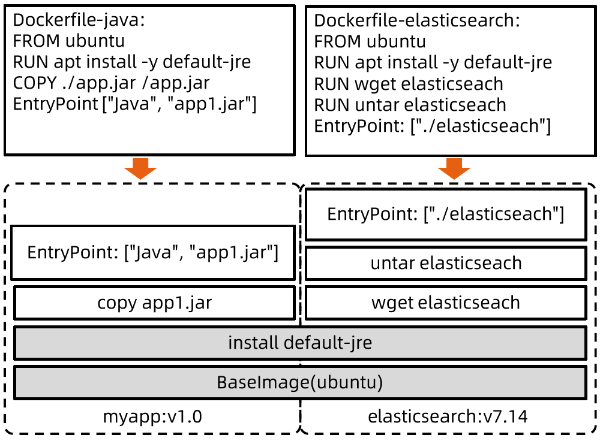

:confused: **Linux UnionFS?**

- A layered FS that unite multiple Dir into a single vDir
- Read-only & Writable Layers
- **Copy-on-Write**: write-in read-only layers → copy in the writable layer
- Allocate-when-used


:confused: **Docker FS?**

- Bootfs: bootloader loads kernel & umount after kernel in-mem
- rootfs: /*


:confused: **Docker FS start？**

1. Load rootfs in readonly
2. Union mount a readwrite FS on top of rootfs
3. Set readwrite FS as readonly, and repeat setup#2 until all set


:confused: **OverlayFS?**

- Upper as container writable
- Lower as image layer
- UC: low IO





:bookmark_tabs: **Hands-on**

```bash
# create dir
$ mkdir overlayfs && cd $_

$ mkdir upper lower merged work

$ echo "from lower" > lower/in_lower.txt
$ echo "from upper" > upper/in_upper.txt
$ echo "from lower" > lower/in_both.txt
$ echo "from upper" > upper/in_both.txt

# merge
$ sudo mount -t overlay overlay -o lowerdir=`pwd`/lower,upperdir=`pwd`/upper,workdir=`pwd`/work `pwd`/merged

# chk
$ cat merged/in_both.txt  # upper/in_both.txt
$ cat merged/in_lower.txt
$ cat merged/in_upper.txt
$ df -h | grep overlayfs

# clean
$ delete merged/in_both.txt
$ delete merged/in_lower.txt
$ delete merged/in_upper.txt
```

