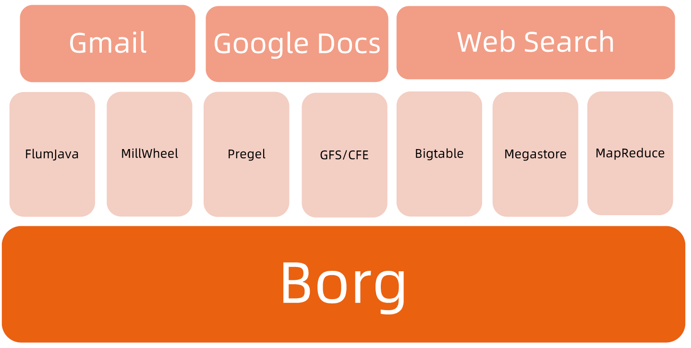
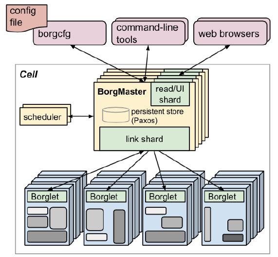

:confused: **What is [Borg](https://storage.googleapis.com/pub-tools-public-publication-data/pdf/43438.pdf)?**

- Google homemade cluster management system. 
- It admits, schedules, starts, restarts, and monitors the full range of applications that Google runs.

:confused: **Features?**

- High utilization: prod (busy & preemptive) & non-prod (idle) hybrid deployment → cost-saving.
- Shared servers.
- Proc-level isolation.
  - Security-level: Chroot jail → Namespace
  - Performance-level: Cgroup
    - compressible (CPU) vs. non-compressiable (Memeory, terminate if limit reached)
- HA
- Fast fault-recovery.
- Felxible schduling strategy.
- Job self-descriptive.

:confused: **Term?**

- Workload: prod (oneline, long-lived, delay-sensitive) vs. non-prod (shot-lived, batch)
- Cell: where Cluster running on top of
- Job/Task: unit to submit, task as replica cnt.
- Naming: for service discovery.

:confused: **Arch?** Centralized

- **Borgmaster**
  - Handles client RPC request.
  - Maintains comp & svc status
  - Communicates with Borglet
- **Scheduler**
  - Strategy: Worst/Best Fit (largest/smallest avail resource to saftify request) & Hybrid.
- **Borglet**
  - Agent runs on Server.
  - Handles request from Borgmaster.

:confused: **HA?**

- Arch: Components in redudancy, cell-level isolation.
- App
  - Preempted non-prod task to pending queue, waiting for re-scheduling.
  - Fault-domain deployment.
  - Idempotence client req.
  - Task shall not be killed no matter Borgmaster/Borglet is down.