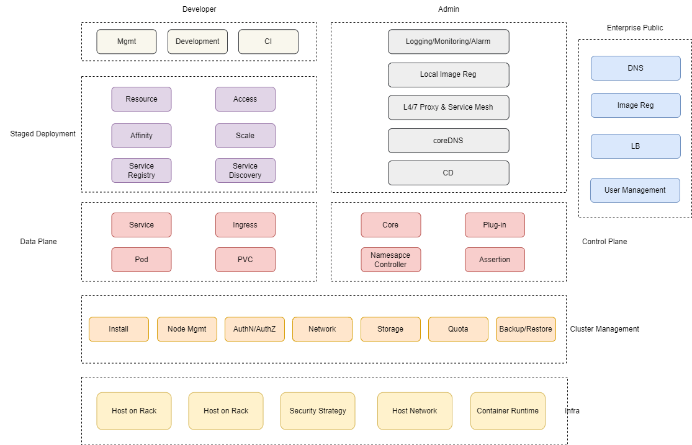
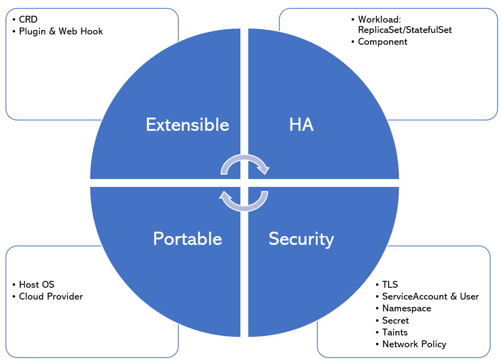
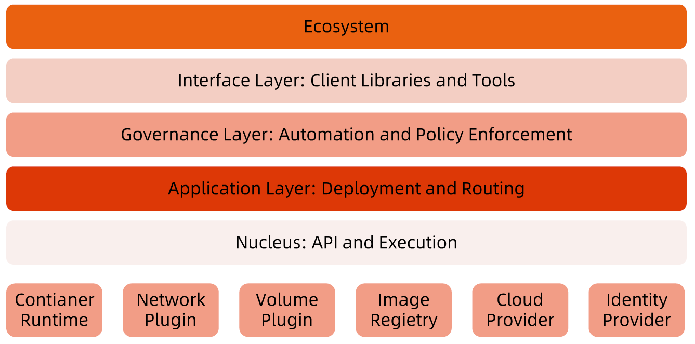
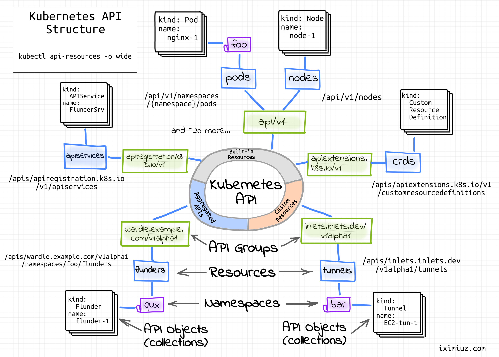

:confused: **Ecosys?**

:confused: **Design?**

:confused: **Layered?**

- **Ecosystem**
  - Ext.: Logging, Monitoring, Conf Management, CICD, Workflow ...
  - Int.: CRI/CNI/CSI, Reg, Cloud Provider. Identity Provider
- **Interface**: kubectl, SDK, Cluster Federation
- **Governance**: Scale, Automation, Strategy (RBAC, Quota, NetworkPolicy...)
- **Application**: Deploy, Routing (SD, DNS)
- **Nuclues**: API & Hook

:confused: **API?** vs: API is repr, while API Object is a (persistent) record of intent/desire.

- Declarative.
- High cohesion (group functions) & Loose coupled (less dep).
- Business-oriented.
- Low-level reused by High-level.
- Complexity < O(N), otherwise :no_entry: horizontal scale.
- API Object status does not depend on network.

:confused: **Principle?**

- Only API Server can access etcd, other components talks to API Server to get cluster status.
- Single-point Failure shall not affect cluster status.
- Event listening (non-blocking) > Polling (blocking)