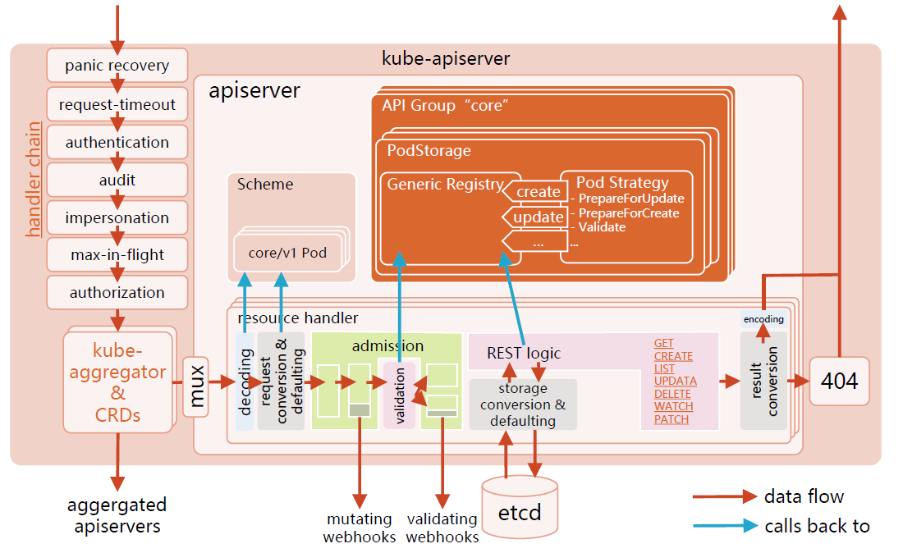

:confused: **What is kube-apiserver?**

- REST API Exposer → (HTTP handler * N) → AuthN (401) | AuthZ (403) | Admission → etcd.
- Hub to other components.
- The ONLY allower to etcd.
- [Flags](https://kubernetes.io/docs/reference/command-line-tools-reference/kube-apiserver/)


:confused: **Flow?**

- **Hander Chains**
  - **Panic Recovery**: handle unexpected situations that might cause the *API server* to crash.
  - **Request-timeout**: set global timeout.
  - **AuthN**: id check.
  - **Audit**: record Who did What to Which (Obj).
  - **Impersonation**: ++ Req Header.
  - **Max-in-flight**: limit req# within API Server
  - **AuthZ**: permission.
- **kube-aggregator & CRD**
  - API Aggregation, proxy (to other apiservers) if not local API.
- **Resource Handler**
  - Decoding: deserialize from JSON → Go Object.
  - Conversion & Defaulting: to in-cluster Object.
  - Admission
    - mutation (webhook)
    - validation (webhook)
- **etcd**
- **Return**





## AuthN

- X.509: `--client-ca-file`
- Static Token: `--token-auth-file`
- Bootstrap Token: kubeadm
- Static Password: `--basic-auth-file`
- ServiceAccount: /run/secrets/kubernetes.io/serviceaccount
- OpenID: OAuth2.0
- Anoymous: `--anonymous-auth` (set to false)
- Webhook: `--authentication-token-webhook-config-file` & `--authentication-token-webhook-cache-ttl`
  - :warning: Avoid piles of retry in K8s → crash ext. Identity services.
  - :construction_worker: Delay, Circuit Break, Rate Limit.

### [Guard](https://github.com/kubeguard/guard)

- A [K8s Webhook AuthN](https://kubernetes.io/docs/reference/access-authn-authz/authentication/#webhook-token-authentication) server. One can log into your K8s using various auth providers.

## AuthZ

vs.

- ABAC: Attributed-based, require master node ssh & filesystem permission :cry:
- **RBAC: Role API-based, "Who (User/Group/SA) can do What"**
  - `[Cluster]Role`: apiGroups, resources, verbs
  - `[Cluster]RoleBinding`: subjects, roleRef


:confused: **Group?**

- To ext. AuthZ, Group = Users * N.
- To SA, Group = SA * N in a ns.


:confused: **How to design a Role?**

- User
  - **Admin**: allow All? Definitely not, for example it can't access secret of normal users.
  - **Normal users**: allow create all objs under ns? R/W control on other ns?
- System Account
  - Developed app for comm to API Server.
  - Users can create custom sa. Each ns has "default" sa. ← W permission needed when to API Server.s


:smile: **Auto multi-cluster role control**

- "ns-creator" Role created when new cluster is created
- Whenever a ns creation is requested, annotate creator info to ns.
- RBAC controller
  - Watch ns creation event.
  - Get ns creator info (from annotation).
  - Create rolebinding for ns and bind to "ns-creator".


:construction_worker: **Best Practice**

- ClusterRole is cluster-wide, careful.
- CRD is cluster-wide, normal user can only manage it after given persmission.
- src-code driven instead of manual edit.
- No insecure port to Master node.

## Admission

:confused: What?

- Mutating + Validation → create/update/patch/delete only

- [Plug-ins](https://kubernetes.io/docs/reference/access-authn-authz/admission-controllers/) chains, only allow passthrough when all passed.

- [Demo](https://github.com/cncamp/admission-controller-webhook-demo)

  ```bash
  # list all 
  $ kubectl exec -it kube-apiserver-... -- kubapiserver -h
  ```


:confused: **[Mutating|Validating]WebhookConfiguration?**

- Define API object → K8s reg.
- When a req to create/update/delete an object matches the defined API → req to webhook in form of "AdmissionReview".
- Webhook processing & return.
- Persisted modified object to etcd.

