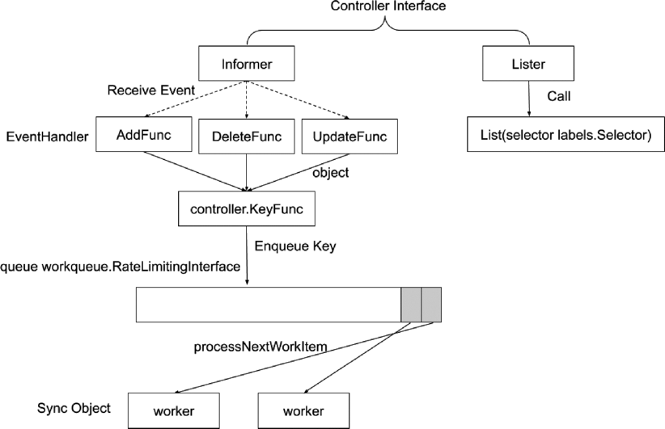

:confused: **What?**

- The "Brain" of K8s cluster.
- "Controller" of "*Controller"
  - Node, Job, Endpoints, Serviceaccount, Namespace (finalizer), Garbage (cascade deletion → ownerReference)
- Reconsilation: "Actual" → "Desired".
- "Eventually-consistent"
- [Flags](https://kubernetes.io/docs/reference/command-line-tools-reference/kube-controller-manager/)


:confused: **Principle?** Controller Interface

- Informer
  - Key watch & reg handler *Func as callback。
    - Add: obj creation to etcd
    - Delete: obj removed from etcd
    - Update: obj attr delta
  - Produce obj key → Queue ← Worker → Lister to get full obj. (local cache)
- Lister
  - Fetch obj status.


:confused: **Why key enqueue not entire obj?**

- Too large.
- If obj gets update frequently, pressure on workers.
- If just key, secure uniqueness no matter how many times of change.
- The last dequeue to call Lister will get the latest delata → "Eventually-consistent".





:confused: **Informer?**

1. List & Watch from API Server
2. De-serialize from JSON to Go obj enqueue.
3. Informer pop obj.
4. Informer add to thread-safe store by Indexer.
5. Index store key:obj & return key.
6. Dispatch event handler func with key.
7. Resource Event Handler push obj key into workqueue.
8. Worker pop key from workqueue to handle.
9. Handler call Indexer to fetch obj by key.


:smile: Typical

- User → Create Deployment ← **Deployment Controller** listens & create → ReplicaSet ← **ReplicaSet Controller** listens & create → pod ← **Scheduler** listens & bind pod to worker ← **kubelet** listens & call CRI/CNI/CSI。


:confused: **[Cloud Controller Manager](https://kubernetes.io/docs/concepts/architecture/cloud-controller/)?**

- Integration with Cloud Provider (API).
- [Node|Route|Service]Controller.
- AuthN to Cloud User/ServiceAccount.
- RBAC
- HA for leader election.
- kubelet flag: `--cloud-provider=external`
- Customization
  - Ingress, Service, RBAC, Account...


:construction_worker: **Production**

- Keep kube-controller-manager kubeconfig (to API Server). Disable "kubectl exec kube-controller-manager".


:confused: **HA Leader Election?**

- [Lease](https://kubernetes.io/docs/concepts/architecture/leases/) as "Lock"

- Each Instance will try to annotate meta to mark "I'm the Leader" & keep renew-ing.

  - Other instance will check, if mismatch (holderIdentity), will not process further.

  ```bash
  # spec: acquireTime, holderIdentity, leaseDurationSeconds, leaseTransitions, renewTime
  $ kubectl get lease -n kube-system
  ```