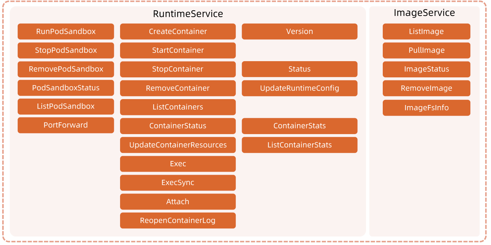
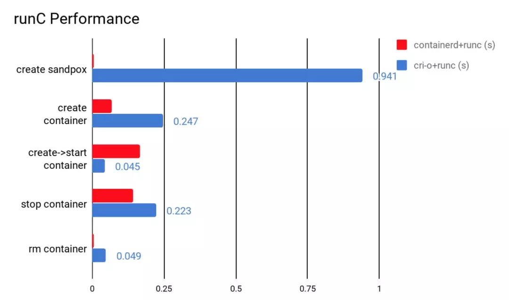

:confused: **What is CRI?**

- A group of gRPC svc → Image (pull/list/del) & Runtime (container LCM + exec/attach/port-forward).

- **Kubelet (grpc client) → CRI → Container Runtime (grpc server).**

- Orchestrator → Engine → (gRPC) High-level Runtim

- e → (shim) → (OCI) Low-level Runtime.

  - [Docker](https://www.docker.com/), [podman](https://podman.io/)
  - [containerd](https://containerd.io/), [cri-o](https://cri-o.io/)
  - [runc](https://github.com/opencontainers/runc), [gVisor](https://gvisor.dev/), [katacontainers](https://katacontainers.io/)

  

​	

:confused: **vs?** Containerd > cri-o.

:confused: **How to check which CR is in-use?**

- kubelet flag: `--container-runtime-endpoint`