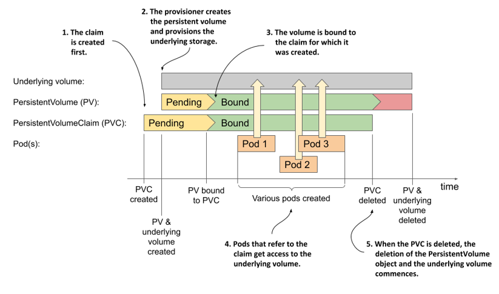

:confused: **Why PV?**

- Decouple pod & underlying storage.
- Pod does not directly points to but reference PVC → PV ← manual or storage plugin + dynamic prov.

 

:confused: **[PV](https://kubernetes.io/docs/concepts/storage/persistent-volumes/), [PVC](https://kubernetes.io/docs/concepts/storage/persistent-volumes/#persistentvolumeclaims) & [StorageClass](https://kubernetes.io/docs/concepts/storage/storage-classes/)?**

- sc: class to desc storage plugin.
- pv: refects a backend vol.
- pvc: claim to pv.


:confused: **[Access Mode](https://kubernetes.io/docs/concepts/storage/persistent-volumes/#access-modes)？**

| Mode             | Abbr | Desc                |
| ---------------- | ---- | ------------------- |
| ReadWriteOnce    | RWO  | R/W one node.       |
| ReadOnlyMany     | ROX  | R mutliple nodes.   |
| ReadWriteMany    | RWX  | R/W multiple nodes. |
| ReadWriteOncePod | RWOP | R/W only one pod.   |


:confused: **[Reclaiming](https://kubernetes.io/docs/concepts/storage/persistent-volumes/#reclaiming)?**

:warning: Make sure delete in order: pod → pvc → pv

| Policy | Desc                                           |
| ------ | ---------------------------------------------- |
| Retain | Keep when pv is released (unbound from pvc).   |
| Delete | Delete when pv is released (unbound from pvc). |


:confused: **Finalizer?** To secure graceful shutdown when a obj is deleted.

- `kubernetes.io/pvc-protection`
  - Block if pvc is still in-use by pod (R/W)
- `external-attacher/cinder-csi-openstack-org`
  - Ensuring that all volumes attached by this CSI driver are properly detached and any associated resources are cleaned up before the Kubernetes object.

```bash
$ kubectl patch pvc <name> -p '{"metadata":{"finalizers":null}}'
```


:confused: **Dynamic Prov?**

1. PVC created.
2. Storage Plugin (PV & VA) controller listens & invoke driver (read sc) to provision vol & attach to node.
3. PV bound to PVC.
4. PV in-use.
5. PVC & PV deleted.





:construction_worker: **Production**

- Different storageClass for differernt media.
- Each physical disk shall create only one PV instead of multi-partition:pv(s) to avoid IO interference.
- Local storage requires disk diagnostics → alarm/auto cordon...