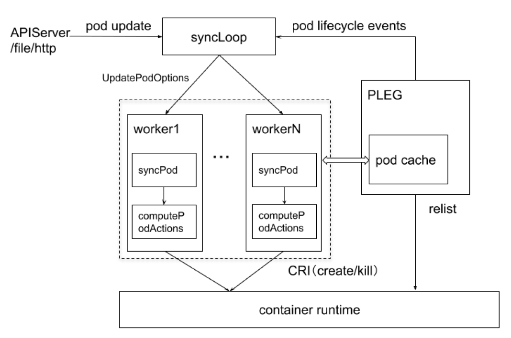
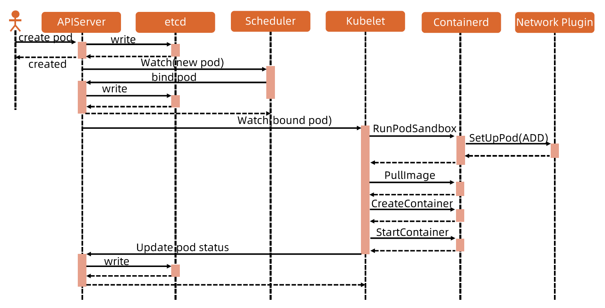
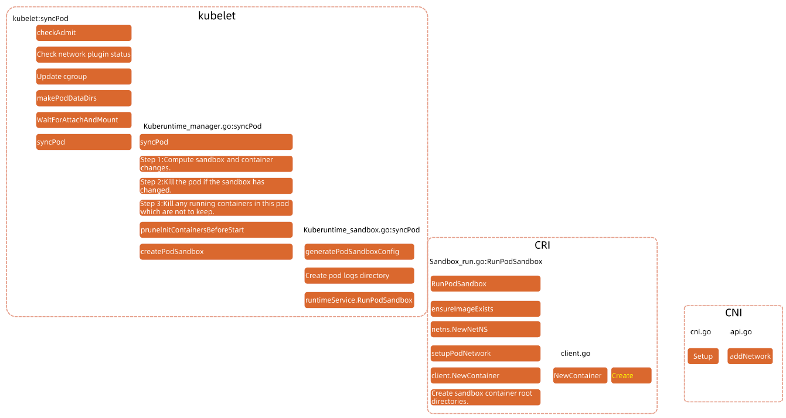

:confused: **Flow?**

- **syncLoop** keeps listening event of `PodConfig` from src: file/http/API Server.
- **syncLoop** fetch `PodLifeCycleEvent` from PLEG.
  - **PLEG**: Pod Lifecycle Event Generator
    - It generates lifecycle events (Container[Started|Died|Removed|Changed]) for pods.
    - It maintains a **Pod cache** → relist → CR.
- **syncLoop** saves `UpdatePodOptions` → Queues ← **PodWorkers** syncPod & computePodActions (what to do) → CR.

:confused: **Pod startup?**

1. User create pod → API Server → etcd.
2. Scheduler watches if had new pods incoming, starts to pick a node & update `.spec.nodeName`.
3. API Server writes .spec.nodeName to etcd.
4. **kubelet syncloop watches if had news pod to be run on the node.**
5. **kubelet → CR to create Sandbox → Network Plugin to setup network.**
6. kubelet → CR to pull image.
7. kubelet → CR to create & start container.
8. kubelet → API Server to update pod status.
9. API Server → etcd.

:confused: **Chains?**

- **WaitForAttachAndMount** → CSI, otherwise pod won't start.
- CRI **client.NewContainer** → CNI

