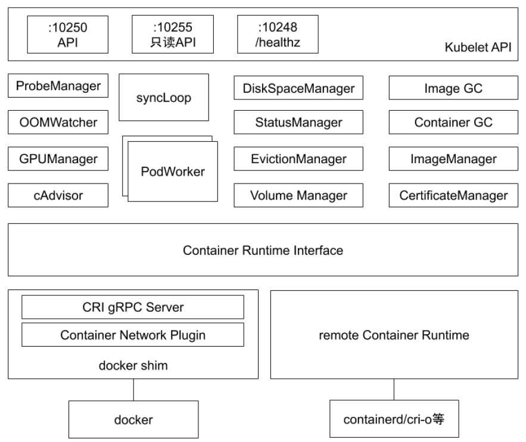

:confused: **What?**

- A "node agent" that reg node to API Server.

  - `--register-node`

- Exec cmd from API Server.

- Pod LCM via CRI.

- Pod Networking via CNI.

- Vol Mgmt via CSI.

- Node/Pod health status & resource reports to API Server.

- [Flags](https://kubernetes.io/docs/reference/command-line-tools-reference/kubelet/) & [Conf](https://kubernetes.io/docs/tasks/administer-cluster/kubelet-config-file/)

  

:confused: **Arch?**

- 10250 | 10255 read-only | 10248 /healthz
- **ProbeManager**: responsible for managing and executing readiness and liveness probes defined in Pods.
- **OOMWatcher**: listening to proc OOM event & reports to kubelet.
- **cAdvisor**: built-in scraper container resource usage & reports to kubelet.
- **DiskSpaceManager**: disk space & emptyDir.
- **StatusManager**: node status.
- **EvictionManager**: listening to mem waterlevel, evict pod by QoS.
- **VolumeManager**: CSI.
- **GC**: Inactive container & images.
- **CertificateManager**: cert.
- **CRI**: Container runtime.

:confused: **podSpec src?**

- static file `--config` flag, default `/etc/kubernetes/manifests`
- (etcd) ← API Server ← listening to
- HTTP Server ← listening to
