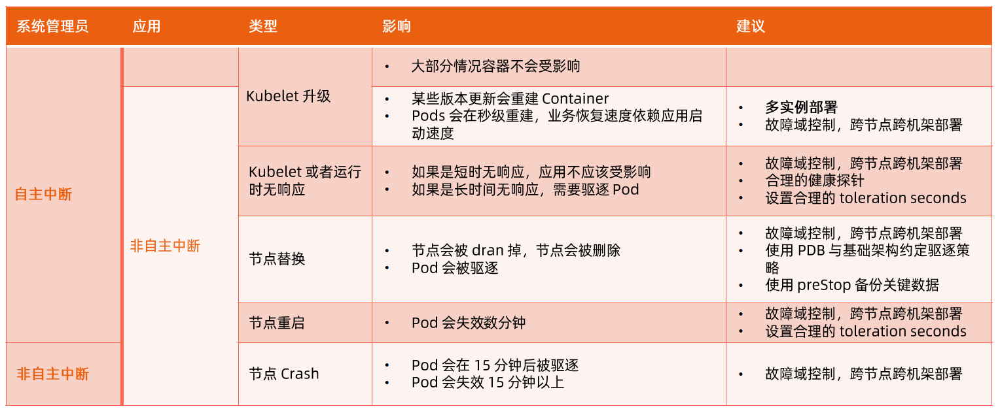

:confused: **Pod Spec?**

- initContainers
- mainContainers (how many?)
  - pid=1 must handle forked well otherwise pid leak → fork bomb.
  - [tini](https://github.com/krallin/tini) → zombie proc‘s parent will be set to 1.
- Privilege to grant
- Namespace to share
- Conf
- Graceful shutdown
- HC (Liveness/Readiness)
- [DNS policy](https://kubernetes.io/docs/concepts/services-networking/dns-pod-service/#pod-s-dns-policy) & impact to `/etc/resolve.conf`
- imagePullPolicy

:confused: **Resource?**

- cpu/gpu/mem
- overselling?
- storage (size, local/network, R/W, IO)
- network (qps, bw)

:confused: **Data to keep?**

- Root Disk `/`
  - emptyDir (sizeLimit)
  - hostPath
  - Log
  - Read-only: configmap, secret
  - rootfs (Image)
- Local
  - ssd: dedicated, fixed size, RW ↑
  - dynamic: LVM, perf ↓

:confused: **Conf?**

- ENV/Vol Mnt ← configmap, secrect, download API

:confused: **HA?**

- Replica, Failure Region, Fine-grained traffic mgmt, RollingUpgrade/Rollback (MaxSurge/MaxUnavaialble).

:confused: **Understand PodTemplateHash?**

- PodTemplate → hash as identity.
- Once PodTemplate is touched, a new hash will be generated and K8s will create a new ReplicaSet with new pods created while old ones will be deleted.
- **Note: a single touch will impact availablility.**

:confused: **Reaction to infra disruption?**

:confused: **Constraints to infra & dev?**

- infra: cordon → drain
- dev: PDB

:confused: **[PodDisruptionBudget](https://kubernetes.io/docs/tasks/run-application/configure-pdb/)?** To secure HA when disruption.

- Stateless
  - Concern: Availability no less than X.
  - Solution: PDB minAvailable (X) or maxUnavailable (1-X)
- Single-instance Stateful
  - Concern: Inform & Get permission before any actions.
  - Solution: PDB maxUnavailable 0.
- Multiple-instance Stateful
  - Concern: No less than quorum Q.
  - Solution: PDB minAvailable (N) or maxUnavailable (1)

:confused: **svc pub?**

- type, certM, LB, gRPC LB, DNS, [up|down]stream
- Challenge
  - kube-dns TTL
  - service
    - ClusterIP
    - kube-proxy mode & drift issue (inconsistency)
    - Pod floating → LB pool impact
    - ELB integration
    - no gRPC
    - no customized DNS & advanced routing.
  - ingress
    - path only, no path/header rewrite & other fine-grained control.