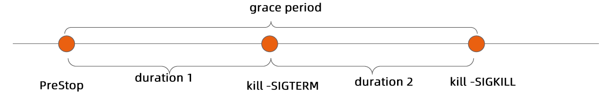
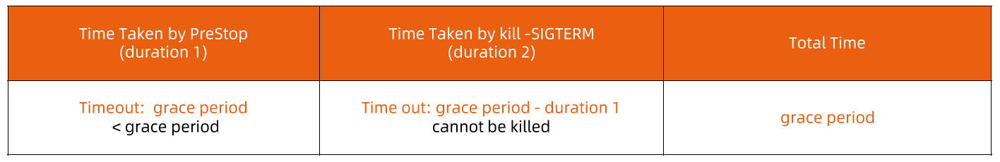

:confused: What is [hook](https://kubernetes.io/docs/concepts/containers/container-lifecycle-hooks/)?

- Extra exec point in LC.
- postStart | preStop → (SIGTERM 15) → (SIGKILL 9)

:confused: **terminationGracePeriodSeconds?**

- Pod's phase will be `Terminating` and remain there until the Pod is killed after expiration. (30s)

:bookmark_tabs: Notes

- Container won't be in "Running" status until postStart ends.
- No guarantee "Entrypoint" & "postStart" which starts first.
- /bin/sh will ignore SIGTERM → SIGTERM will always timeout
  - Avoid long grace period.
  - Use exec.
  - Explicitly handle SIGTERM in entrypoint.sh

:confused: How to be graceful?

- Handle signal properly, forward to child.
- Make sure all children exit before parent.
- Watch & clean up orphans.
- :smile: [tini](https://github.com/krallin/tini)