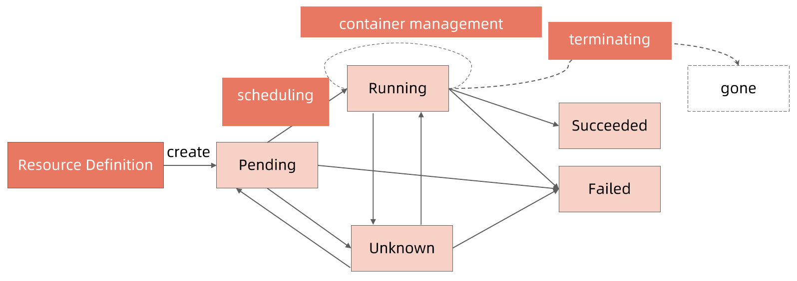
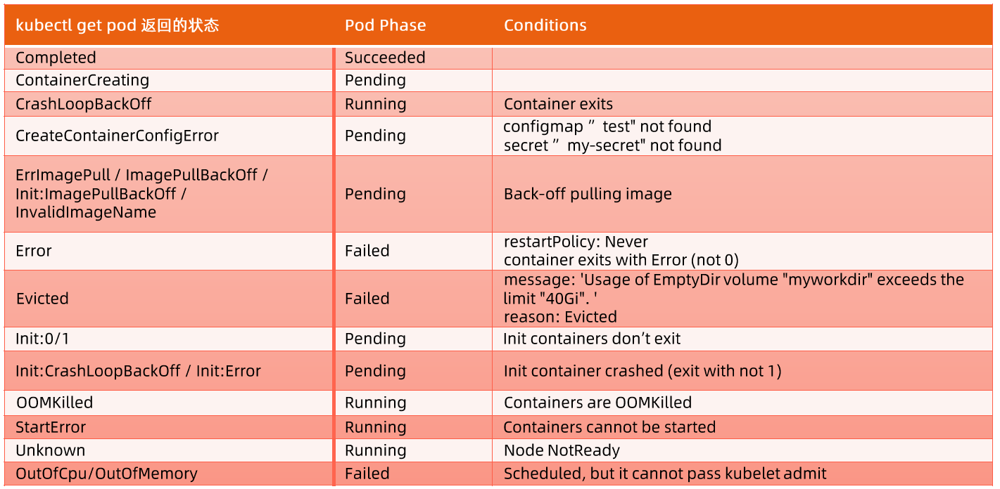

:confused: **Pod State Machine?**

1. CreatePodRequest → API Server → etcd
   - `Pending` : waiting for scheduling (resource req/toleration/[anti]affinity), `.spec.nodeName` not updated yet.
2. ContainerCreating → kubelect → (CSI/CRI/CNI)
   - `Running`
   - `Succeeded`: all containers exit 0, restartPolicy: Never
   - `Failed`: at least one container exit !0, restartPolicy: Never
   - `Evicted`: by kubelet
   - `Unknown`: network issue → API not aware of pod status.
3. DeletePodRequest → API Server → etcd
   - `Terminating`





:confused: **Trace?**

```bash
# status.conditions
$ kubectl get po -o yaml

# event
$ kubectl describe
```


:confused: **vs.**

- Status ← Phase (state) & Conditions (checkpoints)


