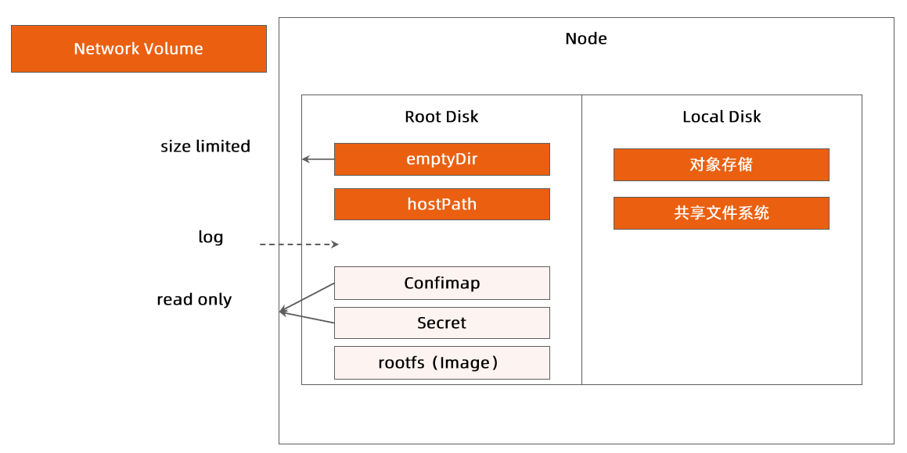

:confused: **Resources?**

- CPU/GPU/Mem each workload?
- Need overselling?
- Storage for each workload?
  - size
  - local | network
  - R/W perf
  - Disk IO
- Network: overall QPS & Bandwidth

:confused: **Challenge from storage?**

- multi-container can shared emptyDir
  - set sizeLimit otherwise risk in root disk
  - regular du from kubelet → perf impact
  - evict if exceeded, everthing will lose

:confused: **Where to keep data?**

| Type           | Persistent after container restart | Persistent after pod restart | size control? | Attention             |
| -------------- | ---------------------------------- | ---------------------------- | ------------- | --------------------- |
| emptyDir       | Y                                  | N                            | Y             |                       |
| hostPath       | Y                                  | N                            | N             | Permission            |
| Local volume   | Y                                  | N                            | Y             | No backup             |
| Network volume | Y                                  | Y                            | Y             |                       |
| rootFS         | N                                  | N                            | N             | DON'T Write Anything! |

:confused: **Conf?**

- src: cm/secret/download API → env/vol mnt

:confused: **HA?**

- replicas?
- Rolling Update strategy?
- PodTemplateHash

:confused: **When container would be possibly killed?**

| Scenario              | Effect                         | Suggestion                                                   |
| --------------------- | ------------------------------ | ------------------------------------------------------------ |
| kubelet upgdate       | pod restart                    | redundanct/cross-regison deployment                          |
| os update/node reboot | pod terminated for minutes     | redundanct/cross-regison deployment probe tolerationSeconds |
| node off-rack         | node drain pod terminated | redundanct/cross-regison deployment pod disruption budget preStop to perform backup |
| node crash            | pod terminated                 | redundanct/cross-regison deployment<                         |