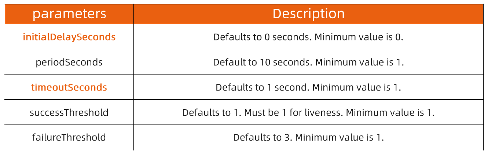

:confused: **Why [probe](https://kubernetes.io/docs/tasks/configure-pod-container/configure-liveness-readiness-startup-probes/)?**

- Make sure in-pod container is avail.
- kubelet probeManager.


:confused: **Type?**

- **liveness**: chk if container is runnning.
- **readiness**: cchk if container is servicing.
- **startup**: before liveness & readiness, friendly to slow start to avoid too many liveness chk.


:confused: **[Method](https://kubernetes.io/docs/concepts/workloads/pods/pod-lifecycle/#probe-check-methods)?**

| Method    | Desc                                                         |
| --------- | ------------------------------------------------------------ |
| exec      | Executes a specified command inside the container. (0)       |
| grpc      | Performs a remote procedure call using [gRPC](https://grpc.io/). (SERVING) |
| httpGet   | Performs an HTTP `GET` request against the podIP:port/path. (200~400) |
| tcpSocket | Performs a TCP check against the Pod's IP address on a specified port. (opened) |

```yaml
apiVersion: v1
kind: Pod
# ...
spec:
# ...
    livenessProbe:
      exec:
        command:
        - cat
        - /tmp/healthy
      initialDelaySeconds: 5
      periodSeconds: 5
---
apiVersion: v1
kind: Pod
# ..
spec:
# ...
    livenessProbe:
      grpc:
        port: 50051
        service: ""
      initialDelaySeconds: 5
      periodSeconds: 10
---
apiVersion: v1
kind: Pod
# ...
spec:
# ...
    livenessProbe:
      httpGet:
        path: /healthz
        port: 8080
      initialDelaySeconds: 3
      periodSeconds: 3
---
apiVersion: v1
kind: Pod
# ...
spec:
# ...
    livenessProbe:
      tcpSocket:
        port: 8080
      initialDelaySeconds: 3
      periodSeconds: 3
```


:confused: **[Fields](https://kubernetes.io/docs/tasks/configure-pod-container/configure-liveness-readiness-startup-probes/#configure-probes) to control?**




:confused: **[Readiness Gate](https://kubernetes.io/docs/concepts/workloads/pods/pod-lifecycle/#pod-readiness-gate)?**

- Additional cond for kubelet to eval pod's readiness.
- `.spec.readinessGates`

```bash
# READINESS field
$ kubectl get po -o wide
```

