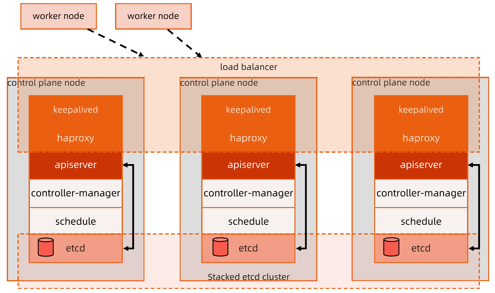

:confused: **DC?**

- Multi-region deployment.
- HA Zone per DC. Each HA zone has
  - power/cooling/netdev
  - stock: rack, compute, storage, LB, firewall...

:confused: **Essense of cluster mgmt?**

- Node LCM.
  - Onboard: stock, os, net, k8s comp, node obj.
  - Fault: tmp/perm.
  - Offboard: del node job & offrack → fix & dispose.

:confused: **Host mgmt?**

- Distro, Kernel, Tool-set, Net
- OS image upgrade → **Over The Air** like A/B.

:confused: **Production?**

- Node# per cluster?
- Divide cluster into regions?
- Divide env (dev/test/prod) inside cluster? Tenants mgmt?
- Automation → setup, upgrade
- Enterprise public svc integration
  - Identity Access Management
  - DNS, LB
  - Proper timeout for sync req. → too long → TPS ↓
  - Retry → jitter

:confused: **Control Plane?**

- Dedicated node in differernt rack.
- Enough resource
- As less dep as possible, such as Cloud Provider API.
- Decouple control & data plane.
- If Add-ons competes with workloads.

:confused: **vs?**

- Binary, [kubeadm](https://kubernetes.io/docs/reference/setup-tools/kubeadm/), [kubepspray](https://github.com/kubernetes-sigs/kubespray), [kops](https://github.com/kubernetes/kops)

