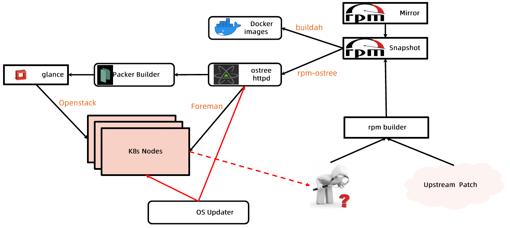

:confused: **Eval?**

- Ecosys, Maturity, Kernel, Runtime-support, Init, Package Mgmt, Upgrade, Security.

:confused: Options?

- Universal: Ubuntu, CentOS, Fedora
- Optimized for Container: [CoreOS](https://github.com/coreOS), [RedHat Atomic](https://projectatomic.io/), [Snappy Ubuntu Core](https://ubuntu.com/core), [RancherOS](https://rancher.com/docs/os/v1.x/en/)
  - Small size.
  - Atomic upgrade & rollback.
  - Highly secured.

:confused: **Immutable Infra?**

- Container Image & OS.

:confused: **Min. OS?**

- Only keep the necessity. Any debug tool can be run as container.
- Secure perf & stability.

:confused: **Practice?** 

- Pull community rpm image & builds snapshots.
- Build patch from upstream patch & internal troubleshooting by rpm builder.
- Build OS from rpm using [rpm-ostree](https://github.com/coreos/rpm-ostree) by treefile.
- Build image by buildah.
- Install
  - Bare Metal: [Foreman](https://docs.theforeman.org/2.4/Provisioning_Guide/index-foreman-el.html) → PXE boot to load kikcstart OS.
  - VM: Packer Builder → Openstack Glance.

