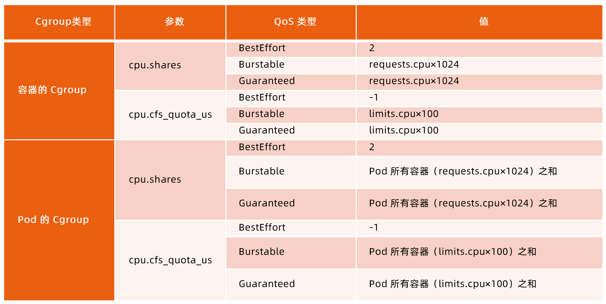

:confused: **NUMA?** Non-Universal Memory Access

- Multi-core cpu - (FSB) - mem arch.
- Each NUMA node owns local RAM.


:confused: **Status Report?**

- kubelet periodically → API Server

  - Node: ip, os, kernel, runtime, version (kubelet & kube-proxy).
    - `node.spec.nodeInfo`
  - Resource: cpu/mem, hugePage, ephemeral storage, gpu & dev from which allocatable.

- kubelet status: Ready, [Memory|PID|Disk]Pressure, NetworkUnavailable.

- (Node) [Lease](https://kubernetes.io/docs/concepts/architecture/leases/) to keep HC meta, marked Un-healthy if not updated in leaseDurationSeconds.

  ```bash
  $ kubectl get lease -n kube-node-lease
  ```

  


:confused: **[Preserve](https://kubernetes.io/docs/tasks/administer-cluster/reserve-compute-resources/) for?**

- Other sys proc like systemd, journald, sshd...


:confused: **vs?**

- `node.status.capacity`: current on node fetched by kubelet.
- `node.status.allocatable`: avail for pod.

| Capacity      |                 |                    |             |
| ------------- | --------------- | ------------------ | ----------- |
| kube-reserved | system-reserved | eviction-threshold | allocatable |


:confused: **Disk mgmt?**

- nodefs: container /data & /log
- imagefs: container image & writable layers.


:confused: **Log Mgmt?**

- logrotate for sys log. ← period & size.
- [Docker](https://docs.docker.com/config/containers/logging/configure/), Containerd ([kubelet](https://kubernetes.io/docs/reference/command-line-tools-reference/kubelet/) du periodically)


:confused: **Vol Management?**

- Disk IO high and would affect others if container proc too many W → writable layer & emptyDir.
- Special IO Requirement use dedicated disk space.


:confused: **Network Management?**

- CNI plugin - [bandwidth](https://www.cni.dev/plugins/current/meta/bandwidth/) → annotations.


:confused: **PID?**

- kubelet [Flag](https://kubernetes.io/docs/concepts/policy/pid-limiting/) (default not limit)
- kubelet reads periodically → `/proc/sys/kernel/pid_max`
- PIDPressure if threshold reached.
- Scheduler will prevent BestEffort pod to node.


:confused: **[Extended Resource](https://kubernetes.io/docs/tasks/administer-cluster/extended-resource-node/)?**

- Resource outide kubernetes.io domain.
- As ext. → node-level, plugin/dev like GPU.
- PATCH to setup `node.status.capcity` by K/V ← kubelet updates `node.status.allocatable`.
  - use in `pod.spec.containers[].resources.limits/requests`

### Eviction

- kubelet sigterm container proc to free res. (won't kill pod)
- kubelet periodically → cAdvisor
- mem/disk-based strategy since cpu is compress-able.

|                    | Desc                                                         |
| ------------------ | ------------------------------------------------------------ |
| memory.avaialble   | avail mem on node                                            |
| nodefs.avaialble   | avail disk under  `/var/lib/kubelet/pods/`                   |
| nodefs.inodesFree  | avail inodes under  `/var/lib/kubelet/pods/`                 |
| imagefs.available  | avail disk under `/var/lib/containerd/io.containerd.snapshotter.v1/overlayfs/` |
| imagefs.inodesFree | avail inodes under `/var/lib/containerd/io.containerd.snapshotter.v1/overlayfs/` |

- [threshold](https://kubernetes.io/docs/concepts/scheduling-eviction/node-pressure-eviction/#eviction-thresholds)
  - soft with grace period.
  - hard without.
- [Flag](https://kubernetes.io/docs/reference/command-line-tools-reference/kubelet/): `--eviction-minimum-reclaim`

#### Memory

default <100Mi hard.

MemoryPressure set to true when triggered.

Scheduler will prevent BestEffort pod to node.

:confused: **How?**

- Check if sum(mem) of in-pod containers, marked targets if over req.
- Check pod PriorityClass, lower will be more easily evicted.
- Check diff btw sum(mem) & req, larger will be more easily evicted.

#### Disk

DiskPressure set to true when triggered.

Scheduler will prevent BestEffort pod to node.

:confused: **How?**

- If had imagefs
  - when nodefs.avail reached, kubelet del exited container.
  - when imagefs.avail readched, kubelet del un-used images.
- Else if
  - kubelet del exited container & un-used images together.
- Else (still reached)
  - kubelet evict running pods. (similar to Memeory).

#### Cgroup





#### OOM

oom_score = (memory_usage / total_memory) * 1000 + oom_score_adj where

|            | oom_score_adj                                                |
| ---------- | ------------------------------------------------------------ |
| Guaranteed | -998                                                         |
| BestEffort | 1000                                                         |
| Burstable  | min(max(2, 1000 - (1000 \* memoryRequestBytes) / machineMemoryCapacityBytes), 999) |

