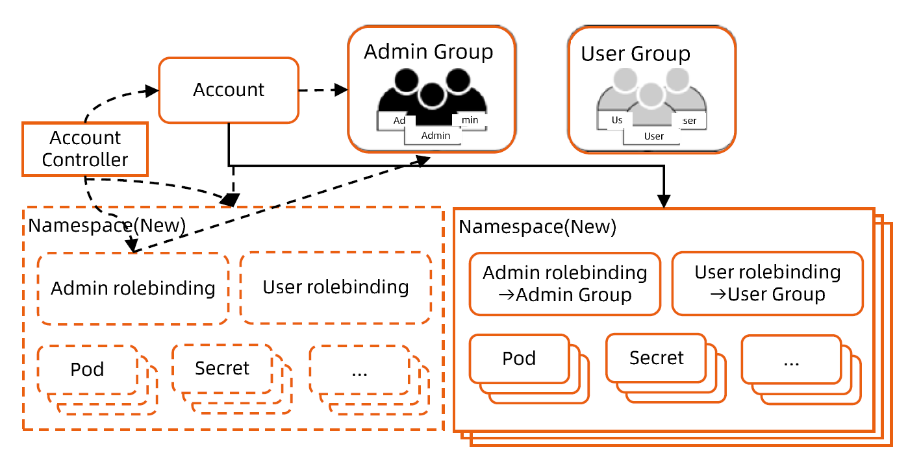

:confused: **What is Tenants?**

- A set of user granted privilege to access certain resources. In multi-tenants ctxt, they would share app/svc/data/conf...
- Tenants btw must be **isolated**.
  - Permission, Network, Data → Namespace, Pod Security Admission, NetworkPolicy
- Tenants share cluster → utilization ↑

:confused: **Basis?**

- Identity Access Management →　AuthN & AuthZ
- What K8s can manage: sa & ext. user → Enterprise Identity svc.

:confused: **Node Isolation?**

- Pod with tolerations scheduled to node with taints.

:confused: **Permission Isolation?**

- By namespace: ns-admin ClusterRole + rolebinding

  ↓

- Auto by mutating webhook, annotate user meta, controller listens ns & create rolebinding.

:confused: [ResourceQuota](https://kubernetes.io/docs/concepts/policy/resource-quotas/)?

- Per ns.