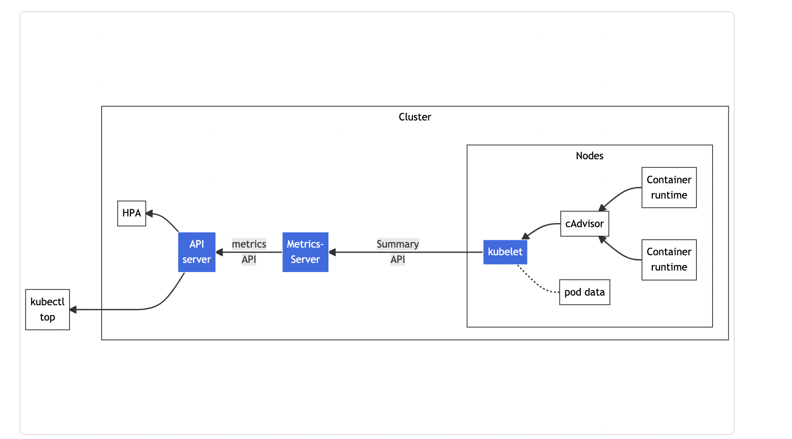
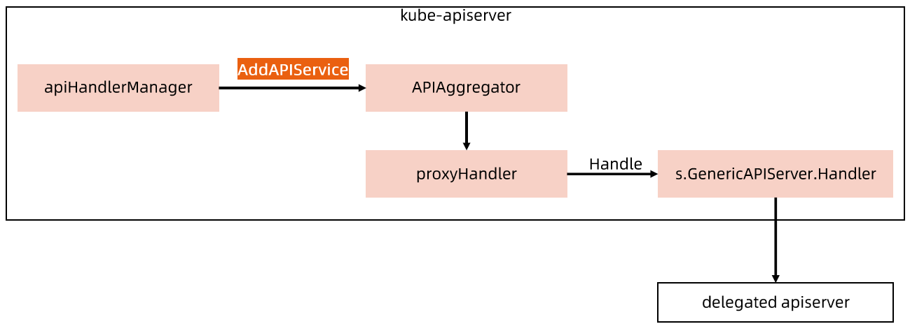

:confused: **What is [metrics-server](https://github.com/kubernetes-sigs/metrics-server)?**

- A scalable K8s built-in pipeline for collecting container resource metrics.
- It only keeps latest metrics, no history.
- In-mem, no persistent.


:confused: **[Install](https://github.com/kubernetes-sigs/metrics-server?tab=readme-ov-file#installation)?**


:confused: **Arch?**

- **cAdvisor**: part of kubelet talks to CR to pull/scrape metrics from CR from containers.
- **kubelet**: expose <u>Summary API</u> `/metrics/resource` & `/stats`
- **Metrics-Server**: expose <u>metrics API</u> `/apis/metrics.k8s.io`
- **API Servers**: Aggregation/Delegation

```bash
# kube-system/metrics-server instead of Local
$ kubectl get apiservice | grep v1beta1.metrics.k8s.io
```

```yaml
spec:
  group: metrics.k8s.io
  groupPriorityMinimum: 100
  insecureSkipTLSVerify: true
  # Any request to metrics.k8s.io will be forwarded to metrics-server:443 svc in kube-system.
  service:
    name: metrics-server
    namespace: kube-system
    port: 443
  version: v1beta1
  versionPriority: 100
```





:confused: **Essense of?**

```bash
# transform kubelet Summary API → metrics.k8s.io API.
# pod/container cpu/mem
$ kubectl get --raw "/api/v1/nodes/<node>/proxy/metrics/resource"

$ kubectl top node
$ kubectl top pod
# GET https://10.0.0.2:6443/apis/metrics.k8s.io/v1beta1/namespaces/eda2/pods
$ kubectl top pod -v 9
```


