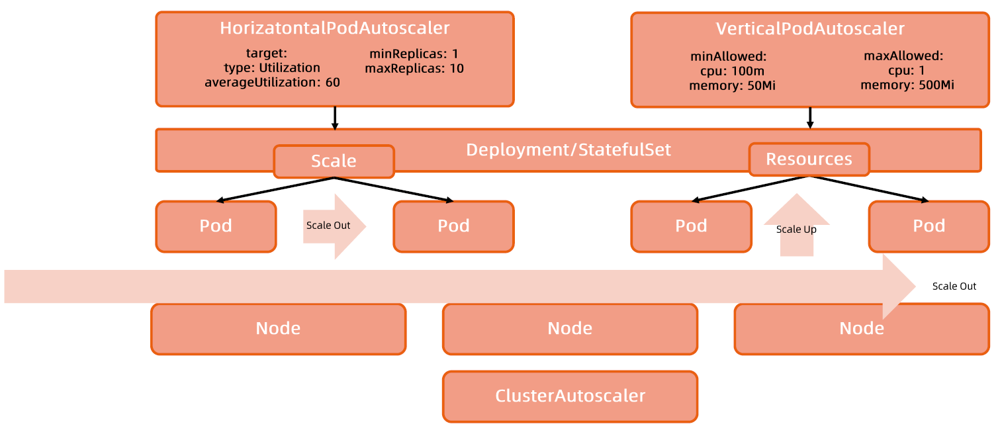

:confused: **What is scaling?**

- High-concurrency boundary → Scaling to ensure availability.

:confused: **vs?**

- Horizontal: ++replicas.
- Vertical: ++resources per workload.

:confused: **Elasticity?**

- Node: Cluster Autoscaler
- Pod: xPA

### HPA

**:confused: [HPA](https://kubernetes.io/docs/tasks/run-application/horizontal-pod-autoscale/)?**

- Rely on metrics-server.
- Be careful any conflicts on the same application.
- **desiredReplicas = ceil[currentReplicas * ( currentMetricValue / desiredMetricValue )]**
- HPA manages `.spec.replicas` ← Replica Controller → scaling action.
  - deploymentSpec replicas type is *int?
- `.spec.behavior`

:confused: **Why deploymentSpec replicas type is *int?**

- Reference type allows K8s could easily updated.

:confused: **Thrashing?**

- Freq metrics change → replica change
- `--horizontal-pod-autoscaler-downscale-stabilization` window for scaling in (5m)

:confused: **Limitation?**

- **Latency**, metrics not real-time → Burst alreay crashed app before scaling out finished.
  - Metrics break threshold.
  - HPA collects these metrics.
  - HAP modify Deployment replica.
  - Pod scheduling including storage & network setup.
  - Application startup.

### VPA

:confused: **What is [VPA](https://github.com/kubernetes/autoscaler/tree/master/vertical-pod-autoscaler)?**

- Rely on metrics-server.
- Node utilization ↑
- `.spec.resources.[cpu|mem].requests` ↑

:confused: **Arch？**

- VPA Controller
  - **Recommender**: calculates recommendation based on the scraped (**histogram** saved as CheckPoint CRD)
    - Percentile in window as threshold.
    - Weight on each sample: `2^(sampleTime - refereceTimestamp / halfLife)` where
      - halfLife is 24h
  - **Updater**: reads recommendation & terminates old pod.
- **VPA Admission Controller** watches VPA API Object and **mutate** spec when pod creation.

:confused: **Limitation?**

- Maturity ↓ Little practice in production (spec change pod will be terminated & re-scheduled)
- Not compatible with HPA.
- Admission Hook conflicts.
- No guarantee for solving all OOM events.
- Requests would exceed Quota → Pending.