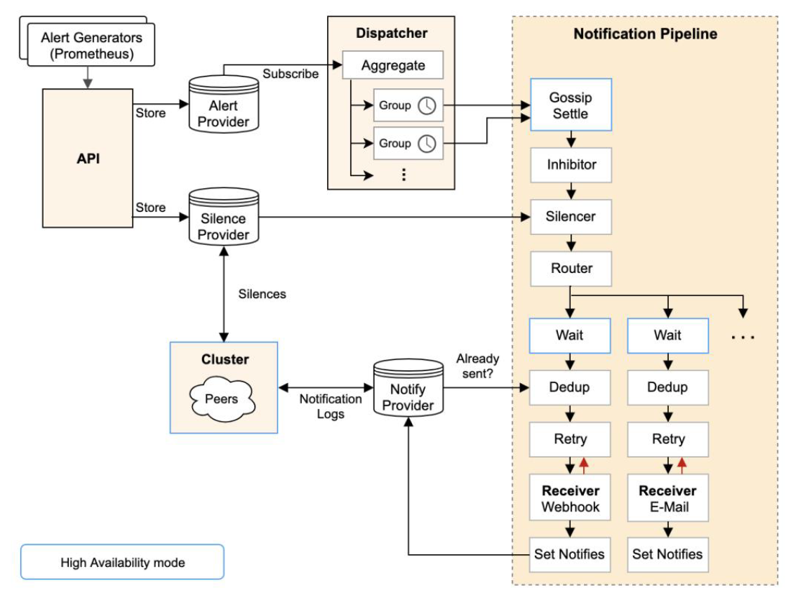

:confused: **Why Alerting?**

- Distributed Nature: Alerting helps in detecting and responding to issues within these individual services.


:cry: **Difficulties?**

- No alert at all.
- Too many alerts = no alert.
- Self-recoverable → no alert needed.


:confused: **Alerting [Rule](https://prometheus.io/docs/prometheus/latest/configuration/alerting_rules/)?**

```yaml
# example
groups:
- name: hostStatsAlert
  rules:
  - alert: hostCpuUsageAlert
    expr: sum(avg without (cpu)(irate(node_cpu{mode!='idle'}[5m]))) by (instance) > 0.85
    for: 10m
    labels:
      severity: High
    annotations:
      summary: "Instance {{ $labels.instance }} CPU usage high"
      description: "{{ $labels.instance }} CPU usage above 85% (current value: {{ $value }})"
```


:confused: **Understand "for=10m"?**

- It indicates that the metric needs to exceed the threshold (i.e., `expr=true`) for a duration of at least 10 minutes before triggering the alert.
- Issues:
  - Sampling if periodic while metric is discrete → below threshold might be not scraped.
  - Eval period ≠ Sampling period → normal sampled value not get evaluated.


:confused: **Arch?**

- Prometheus → AlertManager
- Alert kept in `AlertProvider`, a in-mem map.
- `Dispatcher` as goroutine, keeping pulling alerts from `AlertProvider`, and sends them to `Group` based on Routing Tree (resolved by YAML conf).
- Each `Group` is scheduled to flush & enter `Notification Pipeline`.
- `Notification Pipeline` determines target/receiver to send by rules.





:confused: **[Route](https://prometheus.io/docs/alerting/latest/configuration/#route-related-settings)?**

- It allows configuring how alerts are routed, aggregated, throttled, and muted based on time.

```yaml
# Root route rule, parameters inherited by child rules
route:
  receiver: 'default-receiver'
  group_wait: 30s
  # controls how often the notifications for a group are sent at the earliest.
  group_interval: 5m
  # specifies the interval at which the alerts will be repeatedly triggered.
  repeat_interval: 4h
  # determines how the alerts are grouped together.
  group_by: [cluster, alertname]

  # Alerts that do not match any child route rules will be accepted by the root route rule
  # and forwarded to the default receiver.
  routes:
  # Alerts with 'service=mysql' or 'service=cassandra' labels will be dispatched to the 'database-pager'.
  - receiver: 'database-pager'
    group_wait: 10s
    matchers:
      - service=~"mysql|cassandra"

  # Alerts with 'team=frontend' label will be forwarded to the 'frontend-pager'.
  - receiver: 'frontend-pager'
    group_by: [product, environment]
    matchers:
      - team="frontend"
```


### Practice

:cry: **Bad**

- **Unreasonable rule settings**: only set up notification without any follow-up actions. Important alerts can easily get drowned out or overlooked.
- **Cascading failures**: underlying spread to upper but actually reflecting the same issue.
- **Channel misconfiguration**: less-important → high prio.
- **Expected maintenance issues**: [rolonged upgrade or restart processes without proper advance notification or shielding measures.


:smile: **Good**

- **Runbook** = Take what actions once alert.
  - Even for non-urgent alerts, there should still be some action taken. While immediate processing may not be required, at the very least, a low-priority ticket should be created
  - For alerts that are meant to be informative rather than requiring immediate action, they can be reported through reports, regular inspections, or sent to a separate email group.
- **Level**: critical, error, warning, info, debug.
  - Establishing operational access to determine which systems will be entrusted to operations personnel for maintenance and management.
    - Information Provision: contacts & service-related details.
    - Review Process: no access allowed if no permission.
- Monitoring system must secure **HA**.
- **Different levels → Different channels.**
- **Control # of times & interval** to avoid sending repeatedly.
- **Suppress**: one metric with two strategies
  - If high-prio triggered, low-prio is suppresed.
- **Aggregation** (by dim like receiver & time)


:confused: **Close-Loop?** Send → Take → Handle → Recover → Improve

- Team shift planning.
- Escalation
- Convergence
  - Event → Alert
  - Alert → Incident
    - time
    - time + label
    - time + txt similarity
- Handle
  - If the on-call personnel and their team are unable to handle an alert independently, then it is necessary to escalate it as an incident and involve members from other teams to assist in the resolution.
  - "Red/Black List" to reivew
    - Red: most severe and urgent
    - Black: minor or non-urgent
- Auto
  - Webhook: callback, script.