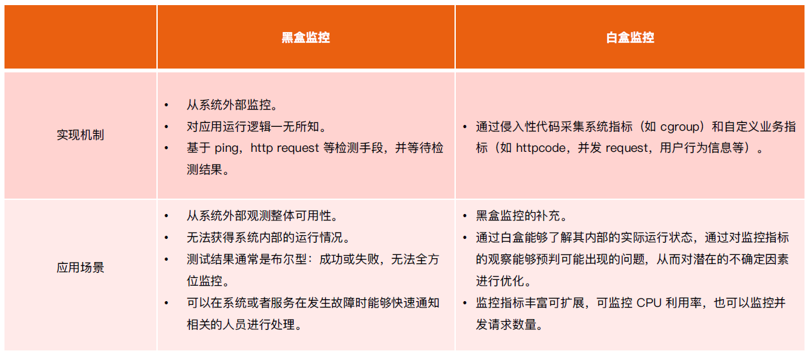
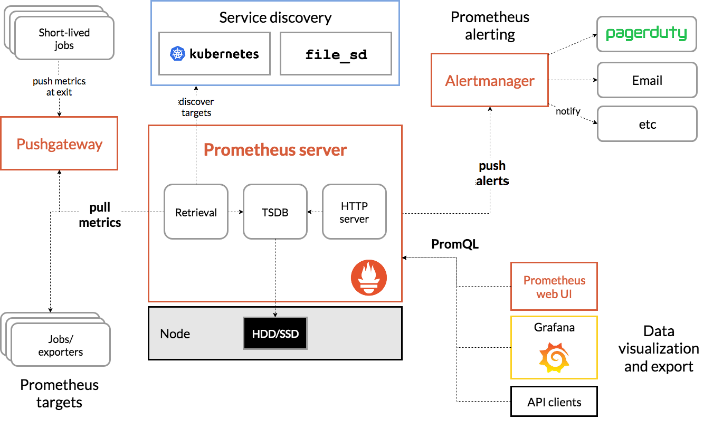
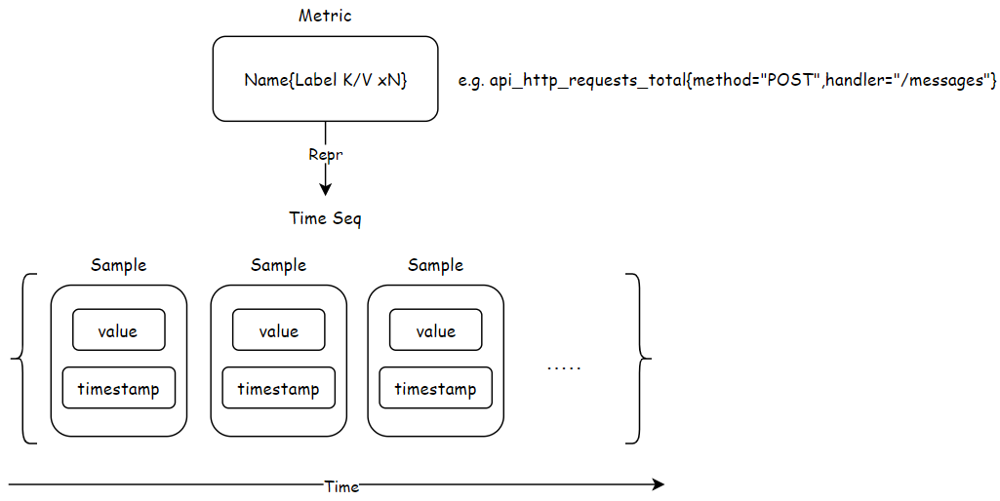

:confused: **Why Monitoring?**

- Know ur sys better such as svc running/health status → secure availability.


:confused: **Target of?**

- Prediction by tendency.
- vs.
- Alert.
- Troubleshooting.
- Visualization.


:confused: **Category?**





:confused: **vs?**

|                  | Push                                        | Pull                              |
| ---------------- | ------------------------------------------- | --------------------------------- |
| Impl             | InfluxDB                                    | Prometheus                        |
| Initiator        | Monitored                                   | Monitor                           |
| Network          | Dst. IP fixed. Need to pass firewall.       | Need to connect to all monitored. |
| Concurrency      | Pressure to                                 | Round-robin                       |
| Fault Detection  | Monitored not awared, keep sending → crash. | Getting slow if overload.         |
| Target Discovery | No                                          | Yes                               |


:confused: **What is Prometheus?**

- An open-source systems <u>monitoring & alerting</u> toolkit.


:confused: **Arch?**

- Prometheus server
  - Retrival: Target Discovery & Scaper to.
  - TSDB: Persistent.
- [Push Gateway](https://github.com/prometheus/pushgateway): for Short-lived jobs.
- Exporter: for Visulization.
- [AlertManager](https://github.com/prometheus/alertmanager): for Alerting.





:confused: **Data Model?**

- Metrics (name + k/v *N) → Sample(value + timestamp) * N





:confused: **Metric [Type](https://prometheus.io/docs/concepts/metric_types/)?**

- Counter ++ only, 0 when reset.
- Gauge ++/--
- Histogram (Data Distribution)
  - counter in Bucket
  - quantile calculated in Server, would overload/OOM if too many scrapee.
  - (upper - lower) * (curr / total) + lower
- Summary (Data Distribution)
  - quantile calculated in Client side then → Server


:confused: **In K8s?**

- Scrape → kubelet (cAdvisor) for host/pod/container metrics

```yaml
# annotate & port
prometheus.io/port: http-metrics
prometheus.io/scrape: "true"
# ...
spec:
  ports:
  - containerPort: 3100
    name: http-metrics
    protocol: TCPs
```

```go
// reg handler for endpoint
http.Handle("/metrics", promhttp.Handler())
http.ListenAndServe(sever.MetricsBindAddress, nil)

// reg metrics
func RegisterMetrics() {
    registerMetricOnce.Do(func() {
    	prometheus.MustRegister(APIServerRequests)
    	prometheus.MustRegister(WorkQueueSize)
    })
}

// export
metrics.AddAPIServerRequest(controllerName,
                            constants.CoreAPIGroup, 
                            constants.SecretResource,
                            constants.Get,cn.Namespace)
```


