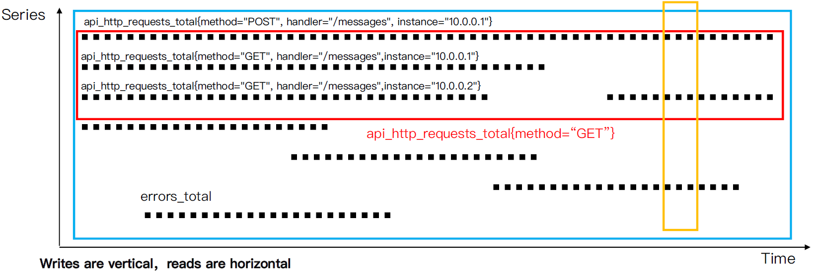
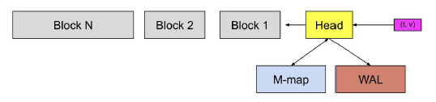
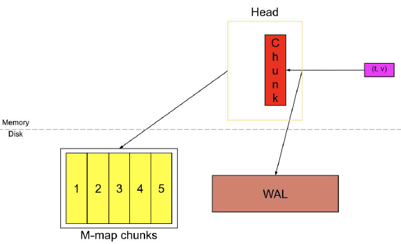
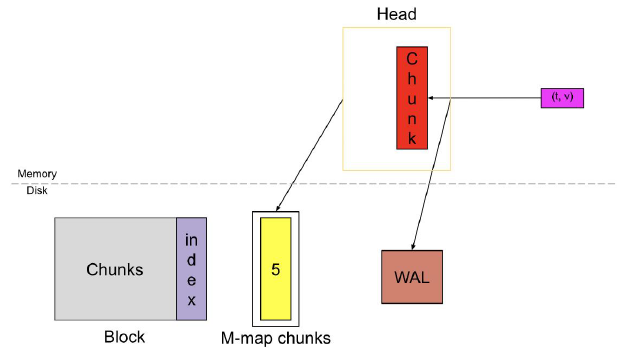
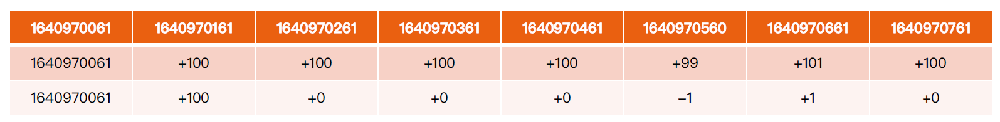
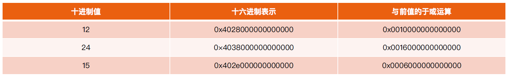

:confused: **What is TSDB?**

- Time-series Database.

:confused: **How is data stored?**

- 2-dim: Time & Series.

- In-mem WAL & On-disk
  - incoming scraped {t,v} → `Head` (in-mem tmp)
  - In-Head `Chunk` * N， each stores all samples in window + meta + index.
    - Only **Active Chunk** accepts Write.
    - Since in-mem, we need WAL to prevent losing data.
  - `Chunk` will be marked "Full" when sample# limit (120) is reached or over a period of time (2h), and new chunk will be created & marked "Active".
    - "Full" `Chink` flush to Disk and use m-map for indexing.
  - When sample# in `Head` over threshold → checkpoint, they will be compacted to a `Block` + Index, WAL entries will be deleted.

:confused: **Indexing?**

- Timeseries in each `Block` has a unique ID.
- Indexing module maintains Label K/V → ID.
- K-way polling

| Label      | TimeseriesID |      |      |      |      |      |
| ---------- | ------------ | ---- | ---- | ---- | ---- | ---- |
| status=200 | 1            | 2    | 3    | 88   | 143  | 1000 |
| method=GET | 3            | 7    | 99   | 138  | 188  | 888  |

:confused: **Compression?**

- Time: init + delta

- Series: 

:confused: **Config?**

- `--storage.tsdb.path`
- `--storage.tsdb.retention.time`
- `--storage.tsdb.retention.size`
- `--storage.tsdb.wal-compression`

:confused: **Capacity?**

- needed_disk_space = retention_time_seconds * ingested_samples_per_second * bytes_per_sample