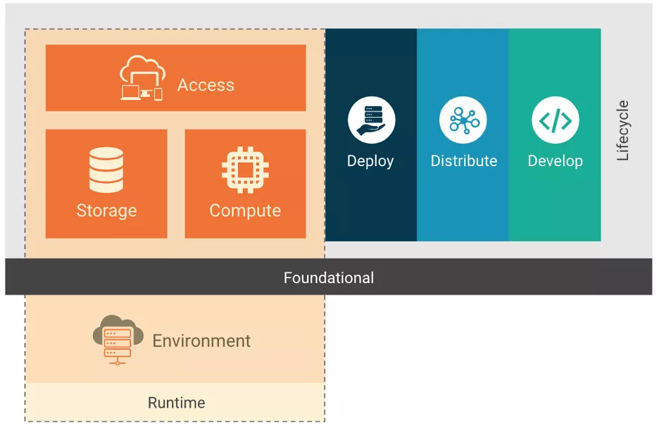

:confused: **Seucrity in Cloud-native context?**

- **Across the entire lifecycle of software.**
- Tradeoff vs. Efficiency.
- How to unite?
- Devops + Security → DevSecOps.

:confused: **Software Lifecycle?**

- **Dev**:

  - 12-factors

    - CIA
      - Confidentiality: Only AuthN-ed & AuthZ-ed user can access.
      - Integrity: No jeopardize in transmission.
      - Avalability: Avail to AuthN-ed & AuthZ-ed user.
    - IaC: Infra as Code, src code driven.

  - Security scan during Pre-commit.

    

- **Distro**: 

  - Integrity check, Image scan, Sign (digest).

  - ImagePolicy Webhook → image failed to pass cannot be deployed.

    

- **Deploy**:

  - Verify sign, Pre-flight check

  - Runtime Policy 

    

- **Run**:

  - (HW-OS-Middle-App)
  - Only AuthZ proc can run under container ns.
  - Dency & report un-AuthZ access.
  - Monitor malacious traffic.