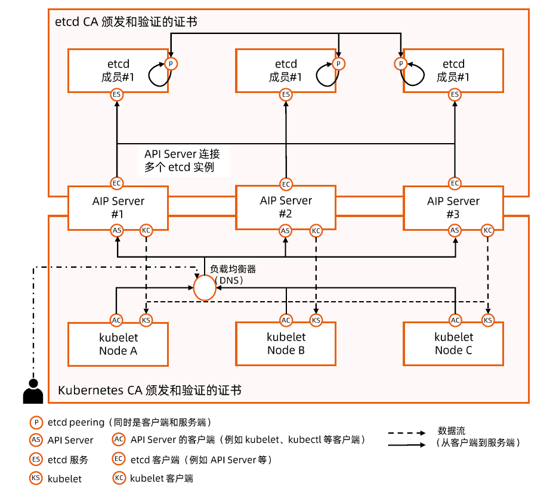

:confused: **How to secure container?**

- Non-root user to start container

  ```bash
  FROM base
  RUN user add rootless
  USER rootless
  # AuthZ rootless +x on ENTRYPOINT only
  ENTRYPOINT ...
  ```

- User Namespace

  - In-container user → non-root user on host.
  - Default is disable as complexity ↑ due to mapping.

- Rootless container

  - CR runs in non-root, like Podman, no daemon.
  - Container ns → Host ns still in non-root.
  - [bitnami practice](https://docs.vmware.com/en/VMware-Tanzu-Application-Catalog/services/tutorials/GUID-work-with-non-root-containers-index.html)


:confused: **How to secure cluster?**

- Principles:
  - Isolate inter-containers, container-host.
  - Minimize negetive impact of container to container & host.
  - Min. AuthZ to component, user & container.
  - Keep senstive data in-transfer/storage.
- By
  - Pod Security Context.
  - API AAA & Quota
  - In-cluster [data Encryption](https://kubernetes.io/docs/tasks/administer-cluster/encrypt-data/).


:confused: **K8s comp TLS?**

- etcd: peer-to-peer, peer-to-API Server.
- API Server: to-client, to comp.





:confused: **[NodeRestriction](https://kubernetes.io/docs/reference/access-authn-authz/admission-controllers/#noderestriction)?**

- Part of Admission Control
- Limits kubelet to modify/del Node & Pod. It can only touch Node itself & pods on top of.
- Prevents actions on labels with prefix `node-restriction.kubernetes.io/`
- ↓ impact in case someone got kubelet kubeconfig.


:confused: **[Taint](https://kubernetes.io/docs/concepts/scheduling-eviction/taint-and-toleration/)?**

- Evict or disable scheduling for pods without tolerations.
- UC: public cloud for different tenants.