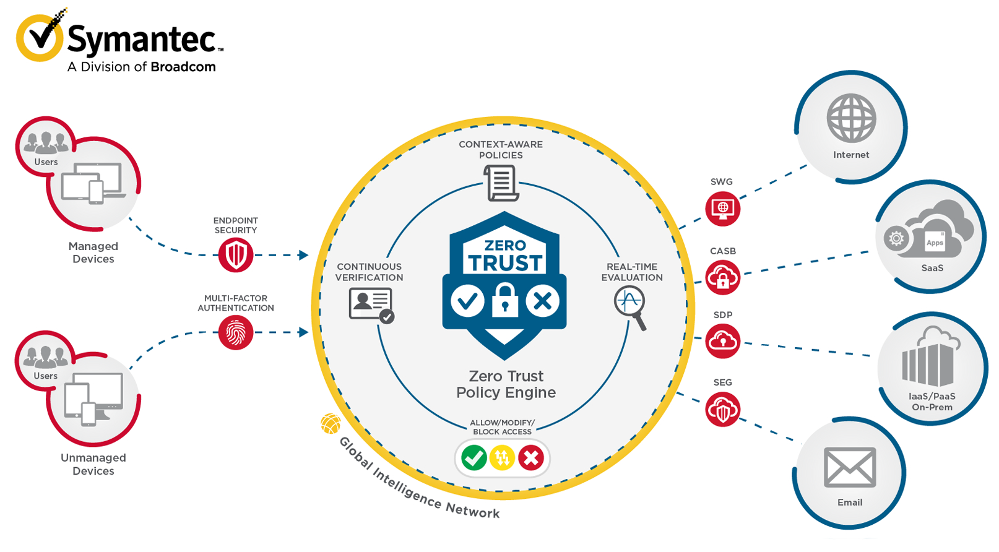

:confused: **What is [DMZ](https://en.itpedia.nl/2023/01/28/wat-is-een-demilitarized-zone-dmz/)?**

- A security measure we use to protect internal network.
- Split to Outside(Internet)/Inside Zone & DMZ (De-militarized Zone)
- Physical Firewall such as F5.
- Published services/servers can be placed at DMZ, while DB in Insize Zone.
- Setup rules on Firewall: Internet → WebServer & WebServer → DB
- :cry: Single-point of FW, terrible if breached.

:confused: **What is [ZTA](https://www.crowdstrike.com/cybersecurity-101/zero-trust-security/zero-trust-architecture/)?**

- CloudNative Arch → boundary blurring.
- Zero Trust → Always require AuthN.
- Presumptioon
  1. Threats everywhere in Internet.
  2. No matter inside/outside.
  3. Network Position does not reflect condifential.
  4. All dev/user/traffic shall have AuthN & AuthZ.
  5. Dynamic Access Control, keep evaluating & adjusting.

:confused: SIM?

- [SDP](https://www.cloudflare.com/learning/access-management/software-defined-perimeter/): Software Defined Perimeter
- [IAM](https://docs.aws.amazon.com/IAM/latest/UserGuide/introduction.html): Identity and Access Management
- [MSG](https://www.cloudflare.com/learning/access-management/what-is-microsegmentation/): Micro Segmentation

