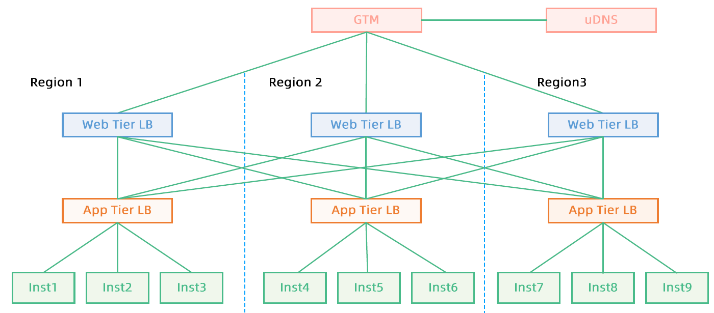
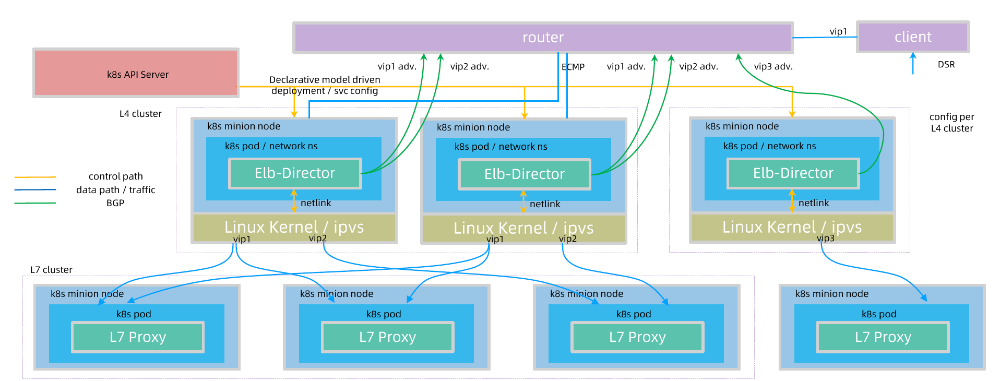
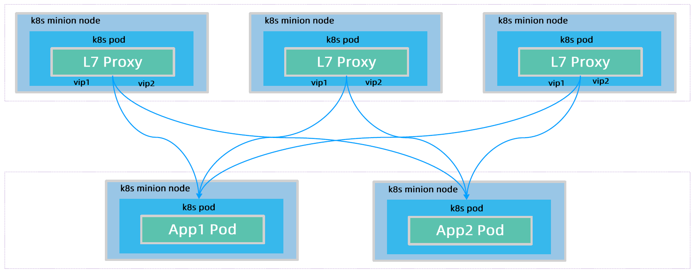
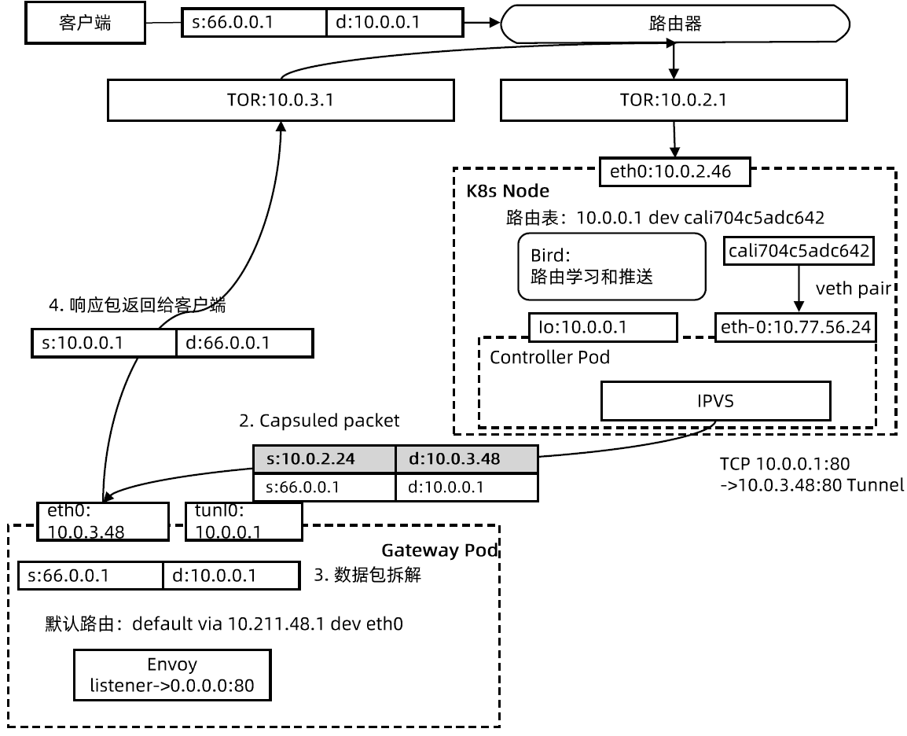
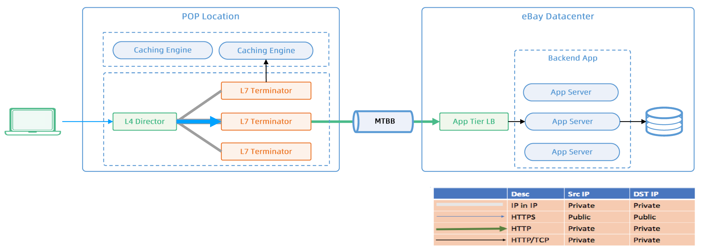

### Ingress Domain

HA → Redundancy (Deployment) & Multi-DC/Region: app svc LB VIP per DC/Region → workloads.

GTM: Global Traffic Manager

TOR: The Onion Router → layered privacy protection.

:confused: **Problems?**

- If router to one region is broken & if client cache DNS record (domainName → VIP), it will keep failing.
- Solution: ++ web LB points to app svcs. However, cross-region → latency ← ++ weight: local high, remote low.

:confused: **Impl?** Self-develop Ingress Controller.

- Reuse K8s LB interface.
- Define **Informer** watches <u>ingress</u>, secret, svc, ep obj.
- Start **Workers** to dequeue & process
  - Create FQDN for Ingress Domain.
  - Create DNS record for VIP.
  - Update Ingress.

:confused: **Why Soft LB?**

- Hard LB cost more.
- M/S → utilization 50%.
- LB onboard/offboard managed by different team.
- Does not support L7
- Hard to flex up/down & migration.

:confused: **To solve?**

- DNS → VIP per Ingress.
- VIP route: L7 & L4.

:confused: **Comp？**

- **L4 Provider**
  - IPAM → VIP binds to VIPS Director.
  - IP tunnel.
  - BGP pub VIP routes.
- **L7 Provider**
  - Envoy L7 Path-forwarding.
  - TLS Termination.
  - Istio Service Mesh.
- DNS Provider
  - Create DNS record.
  - Multi-cluster per Ingress VIP → same DNS record = Federation.
- Ingress Controller (Broadly)
  - Create svc for Ingress & Allocate VIP for.
  - Create cm per Ingress for Envoy conf.
  - Create L7 pod to load Envoy conf.

:confused: **L4/L7 Arch?**

- Create Ingress with FQDN ← (Ingress Controller) watch & create → svc ← (Service Controller) watch & setup L4 LB using IPAM to allocate VIP, use netlink to setup IPVS → L7 Pod.
- L4 → L7 in-cluster by tunnel, IP-in-IP.
- Bird daemon per node to pub & switch routes.
- ECMP (Equal-Cost Multipath) to distribute traffic across multiple equal-cost paths. It allows for LB and redundancy by evenly distributing packets across available paths that have the same metric or cost.
  - nexthop container multiple dst. per path.

### Cross-Continent

:cry: Remote DC → Latency, 300ms+ TCP handshaking...

:confused: E-commerce: heavy → static like pic & descriptives.

:smile: CDN (Content Delivery Network) as closer to enduser as possible to cache.

- Path uncertainty usually no direct.

:confused: **Edge Acceleration?**

- Place Edge DC in areas with high business traffic. 
- Apply Ingress Domain.
  - Pub DNS → Local DNS Provider.

