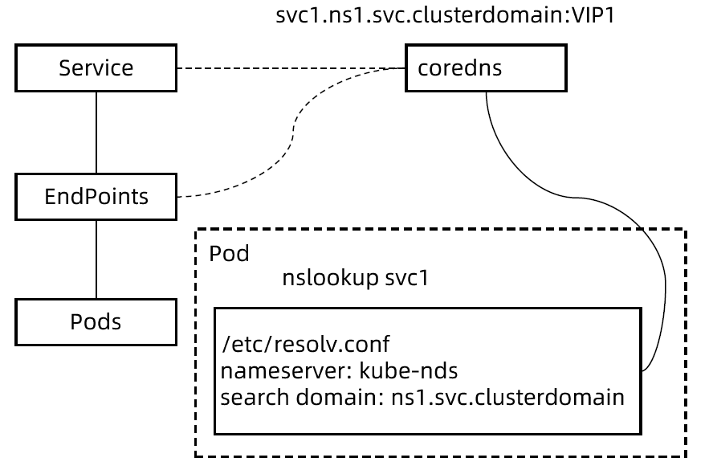

:confused: **What is [coreDNS](https:#coredns.io/)?**

- A in-mem DNS, fast.
- Listening to svc & ep & record FQDN → IP
- In-pod `/etc/resolv.conf` to get corresponding IP by name.
- [Plugins](https://coredns.io/manual/plugins/)





:confused: **Deployment?**

```bash
$ kubectl get pod,deploy,cm -n kube-system | grep core
$ kubectl get svc -n kube-system | grep dns
```

```bash
# listening on 53 port
.:53 {
        errors           # enable error log
        health {         # HC plugin & interval
           lameduck 5s
        }
        # An HTTP endpoint on port 8181 will return 200 OK when all plugins are ready
        ready            
        # k8s
        kubernetes cluster.local in-addr.arpa ip6.arpa {
           pods insecure                      # resolv for in-cluster pod
           fallthrough in-addr.arpa ip6.arpa  # pass to reverse DNS lookup if not match cluster.local    
           ttl 30                             # record TTLS
        }
        prometheus :9153                      # coreDNS Prometheus port
        forward . 10.221.16.10 10.221.16.11 { # upstream DNS
           max_concurrent 1000
           prefer_udp
        }
        # customized
        hosts { 
           192.168.175.136 rldap.3internal.local
           fallthrough
        }
        cache 30 {
          success 9984 30
          denial 9984 30
        }
        # rewrite to new name
        rewrite name k8s-registry.eccd.local  ingress-nginx.ingress-nginx.svc.cluster.local
        rewrite name api.n200-vpod1-oss8986-ipv4.sero.gic.ericsson.se ingress-nginx.ingress-nginx.svc.cluster.local
        rewrite name auth.eccd.local  ingress-nginx.ingress-nginx.svc.cluster.local
        #  loop plugin，allow iter resolve
        loop
        # reload without restart
        reload
        # enable DNS response LB
        loadbalance
    }
```


:confused: **Records of differernt svc type?**

- ClusterIP/NodePort/Loadbalancer

  - A (domainName → ip) & PTR (ip → domainName)
  - SRV (port)

  ```bash
  # A
  svcName.namespace.svc.clusterDomain. in A 10.96.10.11
  
  # PTR
  11.10.96.10.in-addr.arpa. IN PTR svcName.namespace.svc.clusterDomain.
  
  # SRV
  _svcName._tcp.namespace.svc.clusterDomain. 5 IN SRV 10 50 80 svcName.namespace.svc.clusterDomain.
  ```

- Headless

  - multiple A (domainName → ip)

  ```bash
  # A
  podName1.svcName.namespace.svc.clusterDomain. in A 192.168.10.11
  podName2.svcName.namespace.svc.clusterDomain. in A 192.168.10.12
  podName2.svcName.namespace.svc.clusterDomain. in A 192.168.10.13
  ```

- ExternalName

  - CNAME (alias to existing domainName)

  ```bash
  svcName.namespace.svc.clusterDomain.    IN   CNAME   external-service.example.com
  ```

  

:confused: **In-pod /etc/resolv.conf?**

- pod.spec.[dnsPolicy](https:#kubernetes.io/docs/concepts/services-networking/dns-pod-service/#pod-s-dns-policy)
  - `ClusterFirst`: coreDNS first.
  - `Default`: same as `ClusterFirst`.
  - `None`: does not use k8s DNS at all, usually pod itself manage (customized) DNS.
  - `ClusterFirstWithHostNet`: fallback to nodeDNS when `pod.spec.hostNetwork` set to true.

```bash
# if not FQDN & dot number less than options, then try to append & dig
search namespace.svc.clusterDomain svc.clusterDomain clusterDomain
# local dns
nameserver 169.254.20.10
# number of dot
options ndots:5

# query
$ nslookup svc
$ nslookup -query=SRV svc 
```


:confused: **Why nameserver 169.254.20.10?**

- [node-local-cache](https://kubernetes.io/docs/tasks/administer-cluster/nodelocaldns/) as DaemonSet with perf ↑

- If hit, cache return records directly. Else, escalate to coreDNS svc.

  ```bash
  # node
  $ cat /var/lib/kubelet/config.yaml | grep -A 1 clusterDNS
  
  # force_tcp to 10.96.0.10 → coreDNS svc
  cluster.local:53 {
      errors
      cache {
          success 9984 30
          denial 9984 5
      }
      reload
      loop
      bind 169.254.20.10
      forward . 10.96.0.10 {
          force_tcp
      }
      prometheus :9253
      health 169.254.20.10:8080
  }
  
  in-addr.arpa:53 {
      errors
      cache 30
      reload
      loop
      bind 169.254.20.10
      forward . 10.96.0.10 {
          force_tcp
      }
      prometheus :9253
  }
  
  ip6.arpa:53 {
      errors
      cache 30
      reload
      loop
      bind 169.254.20.10
      forward . 10.96.0.10 {
          force_tcp
      }
      prometheus :9253
  }
  
  .:53 {
      errors
      cache 30
      reload
      loop
      bind 169.254.20.10
      forward . 10.96.0.10 {
          force_tcp
      }
      prometheus :9253
  }
  ```


:confused: **.spec.[enableServiceLinks](https:#kubernetes.io/docs/reference/kubernetes-api/workload-resources/pod-v1/)?**

- All svc under ns will be injected as ENV into pod.
- :warning: Issue: CRI → runc to start pod while too many svc ENV → args too long.


:confused: **[Customized](https:#kubernetes.io/docs/tasks/administer-cluster/dns-custom-nameservers/)?**

- nameserver, searches, options


:confused: **Practice?**

- **In-cluster → coreDNS, Out-cluster → EnterpriseDNS.**
- K8s svc needs to be published to Enterprise DNS as well - A/PTR/SRV recrods → LB VIP.
- For headless, create on-demand when podIP is routable.

