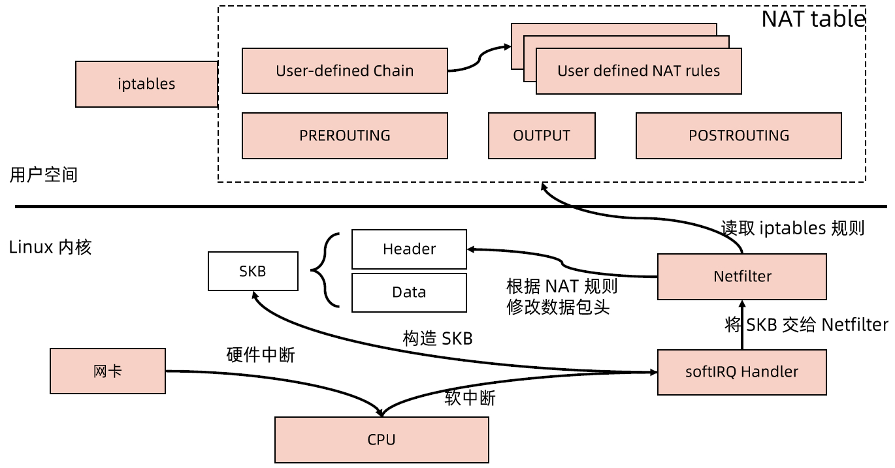
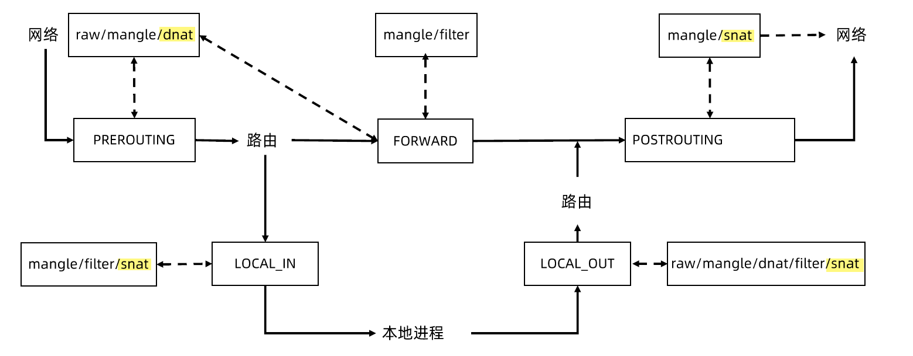
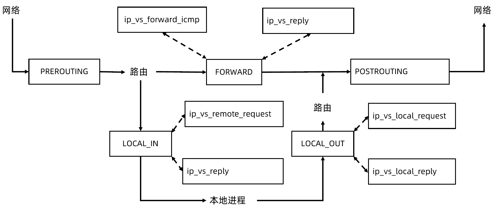

:confused: **What is kube-proxy?**

- Agent on node for network proxy.
- Listening to svc & ep → rule injection → kernel netfilters via iptables.
- Mode: iptables | ipvs
- [Flags](https://kubernetes.io/docs/reference/command-line-tools-reference/kube-proxy/)

:confused: [netfilter](https://en.wikipedia.org/wiki/Netfilter) & iptables?

- Incoming packet → NIC triggers hard interrupt.
- ISR (Interrupt Service Routine) on NIC ack & transfer from NIC buffer to RAM.
- ISR exits hard interrupt.
- softRQ Handler takes deferred work & builds SKB (Socket Buffer) by reading RAM.
- softRQ Handler passes SKB to netfilter.
- netfilter passes to userspace or forward by reading rules.

:confused: **Anchor points?**

| table/chain | PREROUTING | INPUT | FORWARD | OUTPUT | POSTROUTING |
| ----------- | ---------- | ----- | ------- | ------ | ----------- |
| raw         | *          |       |         | *      |             |
| mangle      | *          | *     | *       | *      | *           |
| dnat        | *          |       |         | *      |             |
| filter      |            | *     | *       | *      |             |
| snat        |            | *     |         | *      | *           |

:confused: **ipvs?**

- Slow matching from top to bottom if too many rules & hard to maintain → O(N)
- ++ LVS, in-kernel lookup & MASQ → O(1) using HashTable.
- Since no anchorpoint at PREROUTING, we need routing to decide IP to where.
- IP requires NIC, so ++ ipvs0 dev to bind all svcIP/32 (including LB), in-cluster **ping-able**.
- **:construction_worker: Production: IPVS is perferred.**

| hook              | func                  | core func     | prio                  |
| ----------------- | --------------------- | ------------- | --------------------- |
| NF_INET_LOCAL_IN  | ip_vs_reply4          | ip_vs_out     | NF_IP_PRI_NAT_SRC - 2 |
| NF_INET_LOCAL_IN  | ip_vs_remote_request4 | ip_vs_in      | NF_IP_PRI_NAT_SRC - 1 |
| NF_INET_LOCAL_OUT | ip_vs_local_reply4    | ip_vs_out     | NF_IP_PRI_NAT_DST + 1 |
| NF_INET_LOCAL_OUT | ip_vs_local_request4  | ip_vs_in      | NF_IP_PRI_NAT_DST + 2 |
| NF_INET_FORWARD   | ip_vs_forward_icmp    | ip_vs_in_icmp | 99                    |
| NF_INET_FORWARD   | ip_vs_reply4          | ip_vs_out     | 100                   |

