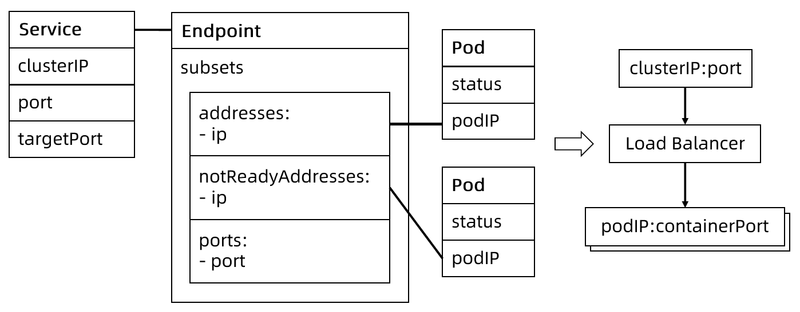

:confused: **What is [svc](https://kubernetes.io/docs/concepts/services-networking/service/)?**

- It provides a single entrypoint to a group of pods (floating IPs).

- L4 (Reverse) Proxy → IP:port * N

- Label-based selector

  ```bash
  # port is svc port
  # targetPort is container port
  $ kubectl expose deploy <deploy> \
      --name= \
      --port= \
      --targetPort= \
      --type= 
  ```


:confused: **No selector when define svc?**

- Endpoint Contronller won't create ep for it.
- we could create it manually & set arbitray ip to subset addr.


:confused: **Type?**

- clusterIP
  - [Flag](https://kubernetes.io/docs/reference/command-line-tools-reference/kube-apiserver/): `--service-cluster-ip-range`
- nodePort
  - [Flag](https://kubernetes.io/docs/reference/command-line-tools-reference/kube-apiserver/): `--service-node-port-range`
- LoadBalancer
- Headless: clusterIP is None.
- ExternalName


:confused: **Fields?**

- `sessionAffinity`: None | ClientIP (same client IP to same port) ← stickness
- `internalTrafficPolicy`: Cluster | Local (forward to pod on the same node only)


:confused: **What is [ep](https://kubernetes.io/docs/concepts/services-networking/service/#endpoints)?**

- A repr of IP:port toward backend pods.
- **Endpoint Contronller** listening to svc & create entries for each label-matched pod.
- Note: only "Ready" pod will be added.





:confused: What is [ep slice](https://kubernetes.io/docs/concepts/services-networking/endpoint-slices/)?

- A scalable & extensible way to alternative ep.
- It split ep to multiple subset, only delta slice will be broadcast.
- [Flag](https://kubernetes.io/docs/reference/command-line-tools-reference/kube-controller-manager/): `--max-endpoints-per-slice`


:confused: **Why ep slice?**

- When svc backs too many pods, once member join/leave, ep delta will be broadcast to all nodes which takes too much bandwidth, pressure on API Server.


:confused: **Topo?**

- Latency btw client & server → same node, rack, AZ, DC
- Failure Domain → replica in different AZ
- Label to mark pod
- topologyKey in pod[Anti]Affinity


:confused: **LB svc [externalTrafficPolicy](https://kubernetes.io/docs/tasks/access-application-cluster/create-external-load-balancer/)?**

- It denotes if this Service desires to route external traffic to node-local or cluster-wide endpoints.
- `Cluster`: obscures the client src IP and may cause a 2nd hop to another node, but should have good overall load-spreading.
- `Local`: preserves the client src IP and avoids a 2nd hop for LB and NodePort type svc, but risks potentially imbalanced traffic spreading.