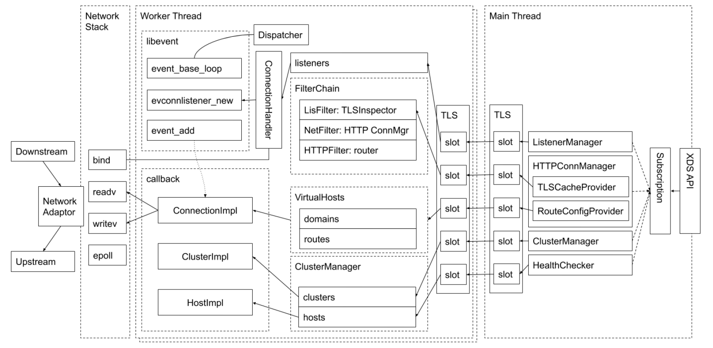

:confused: **Forward vs. Reverse Proxy?**

:confused: **vs.?**

|                  | Envoy            | Nginx             | HAProxy |
| ---------------- | ---------------- | ----------------- | ------- |
| HTTP/2           | [up\|down]stream | upstream only     | N/A     |
| Rate Limit       | Plug-in          | Conf, src IP only | N/A     |
| ACL              | Plug-in L4       | src/dst IP        | N/A     |
| Connection Drain | √                | √ (Plus only)     | ×       |

:confused: **What is [Envoy](https://www.envoyproxy.io/docs/envoy/latest/intro/what_is_envoy)?**

- A L7 Reverse Proxy
  - High perf ← Epoll 100% non-blocking.
  - Extensiable by plugins.
  - Dynamic API conf > Static file conf.

:confused: **Envoy [Term](https://www.envoyproxy.io/docs/envoy/latest/intro/arch_overview/intro/terminology)?**

- **Host**: a logical network app
- **Downstream**: a host sends req to Envoy
- **Upstream**: a host recv conn from Envoy & return resp
- **Listener**: exposed by Envoy to **Downstream**
- **Cluster**: a group of **Upstream**

:confused: **Envoy [Threading Model](https://www.envoyproxy.io/docs/envoy/latest/intro/arch_overview/intro/threading_model)?**

- One proc + multi-threading.
  - Primary thread → coordination.
  - Worker thread → listening/filtering/forwarding.
- Once a conn is accepted by a listener, its LC binds to a single worker thread.
- **Tips: Worker threads num = HW threads num on machine.**

:confused: **Envoy [Arch](https://www.envoyproxy.io/docs/envoy/latest/intro/arch_overview/arch_overview)?**

- Primary thread pull conf from istiod via xDS API.
  - *Managers subscribe & save to TLS (Thread-local Slot) shared by Worker Threads.
- Worker threads read conf in TLS.
  - incoming req will handled by ConnectionHandler.

:confused: **[xDS](https://www.envoyproxy.io/docs/envoy/latest/intro/arch_overview/operations/dynamic_configuration)?** 

- API exposed by control plane (istiod) for Envoy to fetch conf.
  - Listener | Route | Cluster | Endpoint
  
  - Secret | Health | Aggregated
  
    

:confused: [Config](https://www.envoyproxy.io/docs/envoy/latest/start/quick-start/configuration-static)?

- [Static](https://www.envoyproxy.io/docs/envoy/latest/start/quick-start/configuration-static#start-quick-start-static-listeners)
  - listeners: a group of ip:port where Envoy starts & listens on
    - filter_chains
      - route_config → virtual_hosts → routes → cluster
  - clusters: a group of cluster where Envoy will proxy
- Dynamic [from filesystem](https://www.envoyproxy.io/docs/envoy/latest/start/quick-start/configuration-dynamic-filesystem#) & [control plane](https://www.envoyproxy.io/docs/envoy/latest/start/quick-start/configuration-dynamic-control-plane#)
  - dynamic_resources
    - xds_config
  - static_resources (control plane only) → src to fetch conf = to send xDS

:confused: [Securing](https://www.envoyproxy.io/docs/envoy/latest/start/quick-start/securing)?

- Downstream
  - listeners
    - transport_socket → common_tls_context
      - common_tls_context (server keypair)
      - (mTLS) require_client_certificate
      - (mTLS) validation_context (ca cert)
- Upstream
  - clusters
    - transport_socket → common_tls_context
      - validation_context (ca cert & SAN)