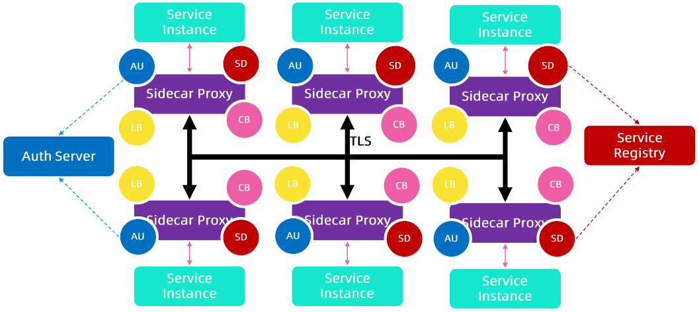
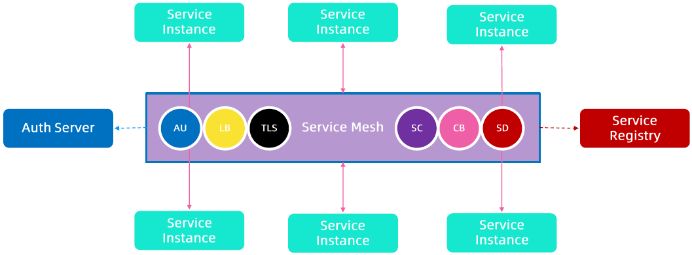

:confused: **Arch Evol?**

- Monolithic → single App Server (Modules * N) + Redundancy ← Admin Server Deployment & Configuration.

  ↓

- MicroService → svc * N 

  :heavy_plus_sign:  API Gateway (API Aggregation).

  :heavy_plus_sign:  Service Registry (Service Discovery).

  :heavy_plus_sign:  Circuit Breaker (Fast-Failure).

  :heavy_plus_sign:  LB (HA).

  :heavy_plus_sign:  AuthN & AuthZ (Identity & Access Control).

:confused: **Feature Boundary?**

- Decouple :heavy_plus_sign: from business logic to platfrom → Sidecar Proxy (as delegator).

:confused: **What happened now?**

- Calls btw svc → Calls btw Sidecar Proxies.

:confused: **What is Service Mesh?**

- A network topo made by these Sidecar Proxies.

:confused: **Pros vs. Cons?**

