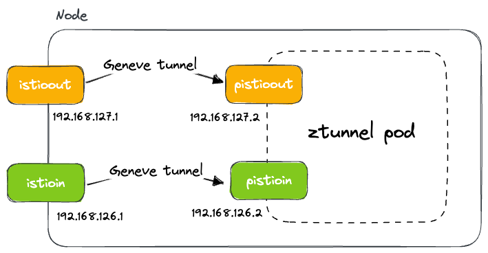

### [Deep Dive](https://istio.io/latest/blog/2023/traffic-for-ambient-and-sidecar/)

`istio-cni` (daemon) replaces the `istio-init` container (in sidecar) and functionally accomplishes the same thing as.

```yaml
securityContext:
  capabilities:
    add:
    - NET_ADMIN
    - SYS_ADMIN
    - NET_RAW
    drop:
    - ALL
```

`istio-cni` (daemon) installs CNI plugins by copying the binary to where container runtime can call.

```bash
# plugin on node
/opt/cni/bin/istio-cni
```

**CNI plugin**

- Node
  - ++ vNIC x2 → `istioin` & `istioout` for inbound & outbound traffic via [GENEVE](https://www.rfc-editor.org/rfc/rfc8926.html) tunnel.

```bash
$ ip link show | grep istio
$ ip -d a show istioin
$ ip -d a show istioout
```
- Ztunnel (daemon)
  - ++ vNIC x2 → `pistioin` & `pistioout` for inbound & outbound traffic via [GENEVE](https://www.rfc-editor.org/rfc/rfc8926.html) tunnel.

```bash
$ crictl ps | egrep "ztun"
$ crictl inspect -o go-template --template '{{.info.pid}}' <container_id>
$ nsenter -t <pid> ip -d a show pistioin
$ nsenter -t <pid> ip -d a show pistioout
```





- Node

  - ztunnel flavored iptables chains → `ztunnel-*`

  - `ztunnel-pods-ips` IP set created to store the IP of pods that are part of the ambient mesh.
    - consulted as part of the iptables rules where the IPs are looked up and marked.

```bash
$ iptables-save
```

```bash
$ ipset list
# chk how route tables are set up using different marks
$ ip rule list
# chk corresponding route table
$ ip route show table <id>
```

**Flow**

1. Outbound Packet → node iptables
2. Packet is marked & sent to node `iostioout` vNIC
3. Node `iostioout` vNIC → Geneve tunnel → ztunnel `pistioout` vNIC


**Ztunnel**

iptables rules using TPROXY mark (`0x400/0xfff`) to direct packets (back) to corresponding ports of ztunnel (in userspace).

| Listening Port | Desc              |
| -------------- | ----------------- |
| 15001          | Outbound          |
| 15006          | Inbound Plaintext |
| 15008          | HBONE             |
| 15053          | DNS Capture       |


```bash
$ crictl ps | egrep "ztun"
$ crictl inspect -o go-template --template '{{.info.pid}}' <container_id>
$ nsenter -t <pid> iptables-save
$ nsenter -t <pid> ip rule
$ nsenter -t <pid> ip route show table <id>
```


Proxy Conf

- **Listener**: ztunnel_outbound → 0.0.0.0:15001

- **Cluster**: spiffe://cluster.local/ns/default/sa/sleep_to_http_productpage.default.svc.cluster.local_outbound_internal

- **Endpoint**: outbound_tunnel_lis_spiffe://cluster.local/ns/default/sa/sleep

  ↓

- **Listener**: outbound_tunnel_lis_spiffe://cluster.local/ns/default/sa/sleep

- **Cluster**: outbound_tunnel_clus_spiffe://cluster.local/ns/default/sa/sleep

  - ORIGINAL_DST
  - ++ Upstream TLS
  - port → 15008 → HBONE

```bash
$ kubectl exec -n istio-system $ZTUNNEL -c istio-proxy \
	-- curl "127.0.0.1:15000/config_dump?include_eds"> ztunnel-conf-include-eds.json
```


### Summary

1. The request from the sleep pod is captured by the rules and iptables configuration on the node.
2. Because the pod is part of the ambient mesh, its IP address was added to the IP set on the node and the packets get marked with the `0x100`.
3. The rules on the node specify that any packets marked with `0x100` are to be directed to the destination `192.168.127.2` through the `istioout` interface. 
4. The rules on the ztunnel proxy transparently proxy the packets from `pistioout` to the ztunnel outbound port `15001`.
5. The ztunnel processes the packets and sends them to the destination – IP `10.244.1.5` (httpbin) which gets captured on the dedicated interface that was created for the httpbin IP on Node B.
6. The rules for the inbound traffic ensure the packets get routed to `istioin` interface.
7. A tunnel between `istioin` and `pistioin` makes the packets land on the ztunnel pod.
8. The iptables configuration captures the packets from the `pistioin` and based on the marks it directs them to port `15008`.
9. The proxy processes the packets and sends them to the destination pod.


