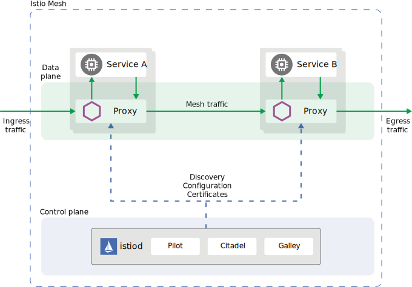

The **control plane** manages and configures the proxies to route traffic.

### Pilot

- It is responsible for converting high-level conf & SD info → specific conf objects that Envoy can read such as:
  - **SR(egistration) & SD(iscovery)**
    - Watches svc/ep (& health status) & CRD (ServiceEntries) → internal svc reg.
  - **Topo Gen**
    - Dynamic Repr with policies enforcement such as LB & Fail-over.
  - **Endpoint Selection**
    - Forward req based on decisions like path/header. → healthy ep.
  - **HC**
    - Relies on (updates from) K8s.
  - **Dynamic Updates**
    - Watch & distribute.

