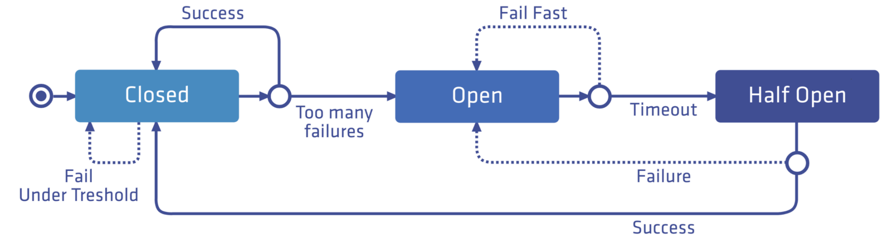

### [Circuit Breaking](https://istio.io/latest/docs/tasks/traffic-management/circuit-breaking/)

A protection mechanism to pretect/prevent upstream from <u>overloading & cascading failure</u>.

1. Initial at `Closed` state, all requests pass through.
2. If failure exceeds the <u>threshold</u>, into `Open` state, fail fast for all requests & start internal <u>timer</u>.
3. <u>Timer</u> timeouts, into `Half-open` state.
4. If request succeeds, back to `Closed` state, otherwise into `Open` state & reset <u>timer</u>.





```yaml
apiVersion: networking.istio.io/v1alpha3
kind: DestinationRule
metadata:
  name: httpbin
spec:
  host: httpbin
  trafficPolicy:
    connectionPool:                 # only 1 http req allowed on top of 1 max tcp conn
      tcp:
        maxConnections: 1
      http:
        http1MaxPendingRequests: 1
        maxRequestsPerConnection: 1
    outlierDetection:               # threshold 1, HC per 1s, ejection 3m
      consecutive5xxErrors: 1
      interval: 1s
      baseEjectionTime: 3m
      maxEjectionPercent: 100
```

